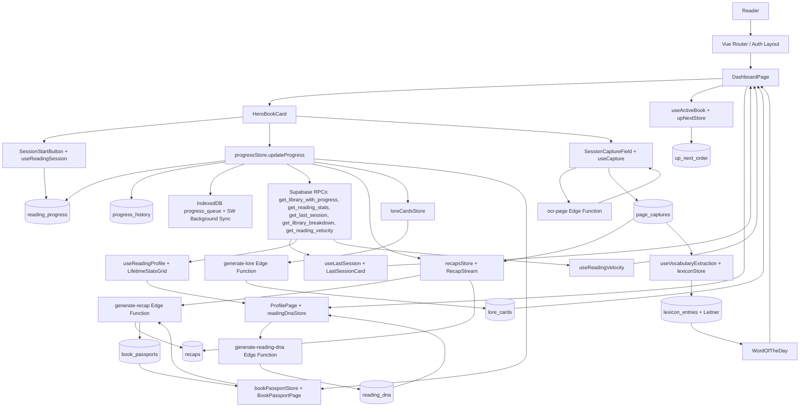
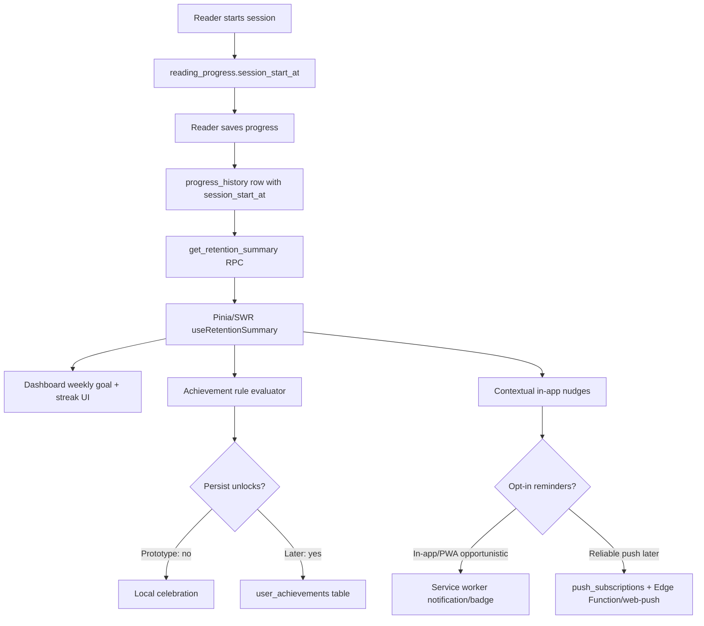

# Research: Reading Retention Gamification

## Executive Summary

- Primary metric should be weekly active reading sessions, not books completed, pages read, XP, or daily opens.
- Best v1 loop: Dashboard weekly rhythm card, default 3 sessions/week, any explicit completed reading session counts, 5-minute/1-page prompt, forgiving comeback state.
- Existing BookHero primitives already support most retention analytics: `progress_history.session_start_at`, Last Session, streak RPCs, velocity, lore milestones, WotD/Leitner, Book Passport, and Dashboard hero flow.
- Add one narrow server-derived retention summary before adding social, notifications, or broad event telemetry; keep weekly counts consistent across Vue now and mobile later.
- Avoid strict daily streaks, public leaderboards, guilt copy, completion-only rewards, and notification-heavy loops; BookHero's audience needs rhythm, recovery, and re-entry support.

## Codebase Today (from codebase-survey)

- Dashboard is the retention home base: routes expose Dashboard, Library, Add Book, Book Detail, Recap History, Great Library/Lexicon, Book Passport, and Profile (`src/router/index.ts:14`, `src/router/index.ts:19`, `src/router/index.ts:29`, `src/router/index.ts:35`, `src/router/index.ts:41`, `src/router/index.ts:46`, `src/router/index.ts:52`); mobile nav persists Home, Library, Great Library, Profile, add-book, and sign-out (`src/components/shared/AppBottomNav.vue:14`, `src/components/shared/AppBottomNav.vue:15`, `src/components/shared/AppBottomNav.vue:18`, `src/components/shared/AppBottomNav.vue:19`, `src/components/shared/AppBottomNav.vue:38`, `src/components/shared/AppBottomNav.vue:79`, `src/components/shared/AppBottomNav.vue:90`, `src/components/shared/AppBottomNav.vue:98`).
- `DashboardPage.vue` composes active hero, in-progress, up-next, completed, Last Session, Word of the Day, recap stream, session capture, and onboarding states (`src/pages/DashboardPage.vue:16`, `src/pages/DashboardPage.vue:17`, `src/pages/DashboardPage.vue:18`, `src/pages/DashboardPage.vue:19`, `src/pages/DashboardPage.vue:20`, `src/pages/DashboardPage.vue:21`, `src/pages/DashboardPage.vue:319`, `src/pages/DashboardPage.vue:351`, `src/pages/DashboardPage.vue:359`, `src/pages/DashboardPage.vue:367`, `src/pages/DashboardPage.vue:377`, `src/pages/DashboardPage.vue:391`).
- `useActiveBook` owns the ephemeral active-book mechanic, excludes hero from Up Next, and auto-promotes after completion only when the completed book was the hero (`src/composables/useActiveBook.ts:12`, `src/composables/useActiveBook.ts:18`, `src/composables/useActiveBook.ts:37`, `src/composables/useActiveBook.ts:65`, `src/composables/useActiveBook.ts:76`, `src/composables/useActiveBook.ts:87`).
- First-run onboarding already distinguishes no-book, queued, active, completed-only, and default states without storage (`src/composables/useDashboardOnboardingState.ts:20`, `src/composables/useDashboardOnboardingState.ts:21`, `src/composables/useDashboardOnboardingState.ts:28`, `src/composables/useDashboardOnboardingState.ts:45`, `src/composables/useDashboardOnboardingState.ts:57`, `src/composables/useDashboardOnboardingState.ts:69`).
- Add-book initial status choices affect side effects: `Want to read`, `Read now`, `Already finished` (`src/components/books/BookForm.vue:30`, `src/components/books/BookForm.vue:32`, `src/components/books/BookForm.vue:33`, `src/components/books/BookForm.vue:35`, `src/components/books/BookForm.vue:129`); import progress bypasses session/history/capture/recap/lore/passport prompts (`src/stores/progress.ts:224`, `src/stores/progress.ts:225`, `src/stores/progress.ts:226`, `src/stores/progress.ts:228`).
- Reading sessions are explicit but lightweight: `useReadingSession` derives active state from server-confirmed `session_start_at`, blocks offline starts, runs elapsed timer, and delegates to `progressStore` (`src/composables/useReadingSession.ts:12`, `src/composables/useReadingSession.ts:30`, `src/composables/useReadingSession.ts:45`, `src/composables/useReadingSession.ts:66`, `src/composables/useReadingSession.ts:71`, `src/composables/useReadingSession.ts:73`, `src/composables/useReadingSession.ts:75`, `src/composables/useReadingSession.ts:83`).
- `progressStore.updateProgress` is the core event stream: optimistic update, `reading_progress` upsert, `progress_history` insert, active-session clear, aggregate cache invalidation, `lastSessionEnded`, milestone detection, offline fallback (`src/stores/progress.ts:287`, `src/stores/progress.ts:292`, `src/stores/progress.ts:297`, `src/stores/progress.ts:338`, `src/stores/progress.ts:343`, `src/stores/progress.ts:351`, `src/stores/progress.ts:357`, `src/stores/progress.ts:370`, `src/stores/progress.ts:390`, `src/stores/progress.ts:392`, `src/stores/progress.ts:416`, `src/stores/progress.ts:439`, `src/stores/progress.ts:443`).
- Database primitives already exist: `books`, `reading_progress`, `recaps` (`specs/001-the-chronicler/contracts/supabase-schema.sql:9`, `specs/001-the-chronicler/contracts/supabase-schema.sql:33`, `specs/001-the-chronicler/contracts/supabase-schema.sql:68`); `up_next_order`, `progress_history`, `lexicon_entries`, `recap_fragments`, `book_passports` (`specs/003-reading-suite-v3/contracts/supabase-schema.sql:10`, `specs/003-reading-suite-v3/contracts/supabase-schema.sql:25`, `specs/003-reading-suite-v3/contracts/supabase-schema.sql:41`, `specs/003-reading-suite-v3/contracts/supabase-schema.sql:66`, `specs/003-reading-suite-v3/contracts/supabase-schema.sql:84`).
- Session stats columns exist: `session_start_at` and `session_note` (`supabase/migrations/20260424_session_stats.sql:5`, `supabase/migrations/20260424_session_stats.sql:8`, `supabase/migrations/20260424_session_stats.sql:10`).
- Existing habit stats RPC: `get_reading_stats` derives valid sessions from `progress_history` and returns `totalPagesRead`, `sessionsThisMonth`, `currentStreakDays`, `longestStreakDays` (`supabase/migrations/20260502_rpc_performance_improvements.sql:60`, `supabase/migrations/20260502_rpc_performance_improvements.sql:78`, `supabase/migrations/20260502_rpc_performance_improvements.sql:84`, `supabase/migrations/20260502_rpc_performance_improvements.sql:92`, `supabase/migrations/20260502_rpc_performance_improvements.sql:133`, `supabase/migrations/20260502_rpc_performance_improvements.sql:142`, `supabase/migrations/20260502_rpc_performance_improvements.sql:148`, `supabase/migrations/20260502_rpc_performance_improvements.sql:156`).
- Last-session RPC/card already compute and show latest progress row, previous page, duration, velocity, completion delta, finish prediction, and note (`supabase/migrations/20260502_rpc_performance_improvements.sql:168`, `supabase/migrations/20260502_rpc_performance_improvements.sql:182`, `supabase/migrations/20260502_rpc_performance_improvements.sql:187`, `supabase/migrations/20260502_rpc_performance_improvements.sql:217`, `supabase/migrations/20260502_rpc_performance_improvements.sql:238`, `supabase/migrations/20260502_rpc_performance_improvements.sql:239`, `supabase/migrations/20260502_rpc_performance_improvements.sql:243`, `supabase/migrations/20260502_rpc_performance_improvements.sql:244`, `supabase/migrations/20260502_rpc_performance_improvements.sql:270`; `src/components/dashboard/LastSessionCard.vue:20`, `src/components/dashboard/LastSessionCard.vue:28`, `src/components/dashboard/LastSessionCard.vue:34`, `src/components/dashboard/LastSessionCard.vue:40`, `src/components/dashboard/LastSessionCard.vue:48`, `src/components/dashboard/LastSessionCard.vue:58`, `src/components/dashboard/LastSessionCard.vue:63`, `src/components/dashboard/LastSessionCard.vue:74`).
- Reading velocity and finish prediction are available through `get_reading_velocity` and `useReadingVelocity` (`supabase/migrations/20260501_reading_velocity.sql:8`, `supabase/migrations/20260501_reading_velocity.sql:18`, `supabase/migrations/20260501_reading_velocity.sql:41`, `supabase/migrations/20260501_reading_velocity.sql:52`, `supabase/migrations/20260501_reading_velocity.sql:109`, `supabase/migrations/20260501_reading_velocity.sql:113`; `src/composables/useReadingVelocity.ts:20`, `src/composables/useReadingVelocity.ts:30`, `src/composables/useReadingVelocity.ts:45`, `src/composables/useReadingVelocity.ts:67`, `src/composables/useReadingVelocity.ts:86`).
- Existing reward primitives: lore milestones via `detectCrossedMilestone` and `lore_cards` (`src/utils/milestoneDetect.ts:2`, `src/utils/milestoneDetect.ts:8`, `src/utils/milestoneDetect.ts:12`, `src/utils/milestoneDetect.ts:34`, `src/utils/milestoneDetect.ts:42`; `supabase/migrations/20260417_lore_cards.sql:17`, `supabase/migrations/20260417_lore_cards.sql:24`, `supabase/migrations/20260417_lore_cards.sql:25`, `supabase/migrations/20260417_lore_cards.sql:49`); Book Passport completion archive (`src/stores/bookPassport.ts:18`, `src/stores/bookPassport.ts:25`, `src/stores/bookPassport.ts:40`, `src/stores/bookPassport.ts:56`, `src/stores/bookPassport.ts:58`, `src/stores/bookPassport.ts:99`, `src/stores/bookPassport.ts:134`, `src/stores/bookPassport.ts:138`); WotD/Leitner daily loop (`src/stores/lexicon.ts:17`, `src/stores/lexicon.ts:31`, `src/stores/lexicon.ts:41`, `src/stores/lexicon.ts:57`, `src/stores/lexicon.ts:71`, `src/stores/lexicon.ts:88`, `src/stores/lexicon.ts:128`, `src/stores/lexicon.ts:133`, `src/stores/lexicon.ts:153`, `src/stores/lexicon.ts:167`, `src/stores/lexicon.ts:176`, `src/stores/lexicon.ts:201`, `src/stores/lexicon.ts:220`).
- SWR cache is centralized and auth-safe; add retention cache keys here (`src/composables/useCache.ts:130`, `src/composables/useCache.ts:132`, `src/composables/useCache.ts:185`, `src/composables/useCache.ts:187`, `src/composables/useCache.ts:190`, `src/composables/useCache.ts:192`, `src/composables/useCache.ts:196`, `src/composables/useCache.ts:197`, `src/composables/useCache.ts:198`, `src/composables/useCache.ts:199`, `src/composables/useCache.ts:201`; `src/stores/auth.ts:38`, `src/stores/auth.ts:45`).
- Offline/PWA support queues progress mutations, not full session starts; `useOfflineSync` drains `IndexedDB` progress queue and SW Background Sync (`src/composables/useOfflineSync.ts:2`, `src/composables/useOfflineSync.ts:12`, `src/composables/useOfflineSync.ts:13`, `src/composables/useOfflineSync.ts:18`, `src/composables/useOfflineSync.ts:31`, `src/composables/useOfflineSync.ts:60`, `src/composables/useOfflineSync.ts:76`, `src/composables/useOfflineSync.ts:82`, `src/composables/useOfflineSync.ts:91`, `src/composables/useOfflineSync.ts:96`; `src/sw.ts:2`, `src/sw.ts:10`, `src/sw.ts:14`, `src/sw.ts:23`, `src/sw.ts:34`, `src/sw.ts:35`, `src/sw.ts:43`).

### Current Architecture

### Gaps vs. What This Feature Needs

- No explicit weekly goal, target sessions/week, weekly challenge, or weekly-session aggregate.
- No persistent habit achievements/badges; existing lore is book-progress-scoped and passport is completion-scoped.
- No streak-freeze, rest-day, pause, travel mode, illness mode, or comeback-week model.
- No social graph, public profile, buddy challenge, feed, leaderboard, or privacy controls for social reading signals.
- No notification/reminder scheduler; PWA support is progress sync, not reliable scheduled nudges.
- `get_reading_stats` has `sessionsThisMonth`, current streak, longest streak; no `sessionsThisWeek`, week window, goal progress, active days, nudge code, or local timezone semantics.
- Existing offline writes can arrive late; durable weekly counts and badge unlocks need server-confirmed history, not queued client state.
- Session semantics need spec clarity: explicit session only vs. legacy page save, minimum duration, minimum page delta, 0-page "showing up", audiobook minutes, imports, rereads, DNF.

## Market and Prior Art

- StoryGraph:
  - Strong reading-native challenge model: public challenge directory, page/minute daily challenges, buddy reads, readalongs, mood/pace filters.
  - Transfer: count partial progress, page/minute/session goals, DNF effort, spoiler-safe checkpoints.
  - Avoid: completion-only annual targets as the primary retention mechanism.
- Goodreads:
  - Familiar annual Reading Challenge and adjustable goals.
  - Transfer: user-owned goals and goal adjustment.
  - Weak direct fit: annual book count is lagging, coarse, and can incentivize shorter/easier books.
- Kindle:
  - Best retention mechanic is convenience plus context recovery: sync, time-left, Recaps, Story So Far, Ask this Book.
  - Transfer: remove re-entry friction before asking for another session.
- Apple Books:
  - Daily reading minutes, 5-minute default goal, streaks, records, yearly books.
  - Transfer: tiny default goal; adapt daily minutes into weekly cadence.
- Apple Fitness / Apple Watch:
  - Activity rings, daily/weekly feedback, trends, awards, coaching, sharing, competitions, rest/pause controls.
  - Transfer: visible progress, weekly summary, concrete coaching, recovery affordances.
  - Avoid: literal ring cloning and daily all-or-nothing pressure.
- Strava:
  - Time-boxed opt-in challenges, active-day goals, clubs, private group challenges, trophy case.
  - Transfer: opt-in weekly/monthly challenges and private cooperative goals.
  - Avoid: public rankings by pages/minutes/speed.
- Duolingo:
  - Tiny daily action, streak, streak freeze, Friend Streak, Friends Quests, widgets/reminders.
  - Transfer: grace tokens/freezes and cooperative weekly quests.
  - Avoid: anxiety-heavy daily streaks, XP economy, leagues.
- Habitica:
  - Task-to-game progress, Dailies, party quests, rewards.
  - Transfer: light quest framing.
  - Avoid: health loss, party damage, punitive missed-task mechanics, complex RPG economy.

## UX Patterns

- Use "Weekly Rhythm" / "Reading Pulse" language; avoid discipline, overdue, failed, catch up, penalty.
- Primary CTA stays book-contextual: Continue current book, Log progress, or Resume with recap.
- Minimum viable session: log any explicit reading, 5 minutes, 1 page, or 1 audiobook minute.
- Dashboard module order:
  - Current book CTA.
  - Weekly rhythm strip: 7-day row, sessions completed, next tiny action.
  - Reward preview: next recap/lore/passport unlock.
  - Editable goal/grace card.
  - Optional challenge/social entry point.
- Progress UI should show multiple scales: today/session, week, current book, yearly/lifetime in Profile.
- Celebration should be immediate, brief, specific, and skippable: "Third session this week", "Returned after 9 days", "First morning read".
- Badge language should reinforce identity and resilience: Sunday Reader, Lunch Break Reader, Slow Burn Finisher, Audiobook Commuter, Return Win.
- Weekly summary should be restorative:
  - Strong week: sessions, books touched, pages/minutes, longest rhythm, unlocked reward.
  - Light week: "You read once; that still counts" plus one tiny next action.
- Challenges should be discoverable but not mandatory:
  - Read 1 page/day for 7 days.
  - Three 10-minute sessions this week.
  - Read from Up Next twice.
  - Unlock one recap by Sunday.
  - Return to one paused book.
- Social should be private by default and opt-in: buddy streaks, family room, small club challenge, mute/hide controls, preview-before-share.

## Technical Approaches and Tradeoffs

- Stage 1: no new persistence except a read-only RPC.
  - Add `get_retention_summary(p_user_id uuid, p_timezone text default 'UTC')`.
  - Default weekly goal to 3 in RPC/client.
  - Return `weekStart`, `weekEnd`, `sessionsThisWeek`, `weeklyGoal`, `goalProgressPct`, `activeDaysThisWeek`, `currentStreakDays`, `longestStreakDays`, `lastSessionAt`, `daysSinceLastSession`, `eligibleAchievements`, `nudgeCode`.
  - Add `useRetentionSummary.ts` with SWR cache and invalidate after `lastSessionEnded` / successful `progress_history` insert.
  - Add pure TS achievement rules in `src/domain/retention/rules.ts`.
- Stage 2: persist user-owned settings and durable achievements.
  - Add `retention_preferences`: `user_id`, `weekly_session_goal`, `reminder_enabled`, `reminder_days`, `reminder_time_local`, `timezone`, `quiet_hours`, `updated_at`.
  - Add `user_achievements`: `user_id`, `achievement_id`, `period_start`, `unlocked_at`, metadata; unique `(user_id, achievement_id, period_start)` where period-specific.
- Stage 3: reminders and analytics.
  - Add `push_subscriptions` only after in-app nudges prove useful.
  - Add typed first-party `analytics_events` only for funnel events; never compute sessions/week from clickstream.
- Client-side achievement rules:
  - Fastest iteration; easy copy/tuning.
  - Risk: duplicated logic for native clients later; needs idempotent persistence if durable.
- RPC/Edge achievement rules:
  - More portable and authoritative.
  - More schema/testing overhead; slower UX iteration.
- Timezone tradeoff:
  - Prototype: pass browser timezone into RPC.
  - Robust: persist timezone in retention preferences and use local week boundaries server-side.
- Offline tradeoff:
  - UI may show pending progress.
  - Durable weekly counts, streaks, and badges unlock only after sync and RPC revalidation.
- Reminder tradeoff:
  - In-app nudges work now and avoid permissions.
  - Browser local notifications are unreliable for scheduled reminders.
  - Reliable web push needs subscriptions, VAPID/web-push infra, unsubscribe handling, Edge Function/send path.

## Anti-Patterns and Known Failures

- Strict daily streaks:
  - Failure: loss aversion, low-quality actions, churn after break.
  - Mitigation: weekly rhythm, active weeks, rest/pause states, comeback celebration.
- Guilt loops:
  - Failure: app becomes another obligation.
  - Mitigation: "Welcome back", "restart gently", no debt or make-up mechanics.
- Vanity metrics:
  - Failure: books/pages/XP replace meaningful reading.
  - Mitigation: sessions/week and return-to-book as primary; reflections as intrinsic reward.
- Notification fatigue:
  - Failure: irrelevant reminders become noise and opt-outs.
  - Mitigation: sparse, contextual, user-configured, quiet defaults; stop after non-response.
- Low-signal badges:
  - Failure: trophy spam and clutter.
  - Mitigation: sparse, legible, behavior-linked badges: return after break, first 3-session week, long-book persistence.
- Cheating/completion gaming:
  - Failure: users optimize short books, fake progress, misclassify activity.
  - Mitigation: no public completion rank; derive from durable session history; allow DNF/reread/slow progress.
- Over-social comparison:
  - Failure: power readers intimidate inconsistent readers.
  - Mitigation: private-first, small opt-in circles, self-baseline comparisons.
- Instrumentalizing reading:
  - Failure: reading becomes productivity work.
  - Mitigation: companion framing, slow reading legitimacy, note/quote/curiosity rewards.
- One-size-fits-all goals:
  - Failure: fixed daily goals punish real life.
  - Mitigation: editable weekly goals, pause mode, baseline-aware suggestions.
- Dark-pattern recovery:
  - Failure: streak protection becomes anxiety sink.
  - Mitigation: free transparent grace, no paid freeze, no shame preservation flow.

## Security and Compliance Risks

- Reading behavior is sensitive profile data:
  - Risk: books, sessions, streaks, pauses, velocity, vocabulary, recaps, Reader DNA, badges infer identity, health, politics, religion, sexuality, school status.
  - Mitigation: minimize derived storage; prefer deterministic derivation from `reading_progress`/`progress_history`.
- Manipulative retention design:
  - Risk: guilt/fear wording, hidden opt-outs, preselected social sharing, coercive notifications.
  - Mitigation: reversible settings, conservative defaults, pause/lower goal, no punishment language.
- Notifications:
  - Risk: persistent push identifiers, lock-screen leakage, permission fatigue.
  - Mitigation: ask only after user configures reminder; generic payloads by default; dedicated token table with RLS and revocation.
- Future social:
  - Risk: accidental public reading history, share-card metadata leakage, generated artifact exposure.
  - Mitigation: private by default; field-level visibility; explicit preview-before-share; whitelisted public projections.
- Analytics:
  - Risk: third-party disclosure and sensitive custom event leakage.
  - Mitigation: first-party Supabase aggregates for prototype; typed analytics wrapper; denylist book titles, ISBNs tied to user, OCR text, recap text, vocabulary terms, notes, prompts, profile slugs.
- AI:
  - Risk: retention features reuse OCR/recap/notes in badges/share cards; vendor log retention; hallucinated personal insights.
  - Mitigation: reference AI artifacts by ID/metadata; strip user IDs/exact timestamps/unrelated profile data from prompts; redact logs; store provenance, not raw prompts.
- RLS:
  - Risk: Vue client is untrusted; exposed tables without RLS leak or allow tampering.
  - Mitigation: RLS on every retention table; `auth.uid() = user_id` policies; `with check`; no service role in frontend; `security_invoker` or controlled RPC for public projections.
- Integrity:
  - Risk: badges/challenges forged from client events.
  - Mitigation: server derives eligibility from durable session history; idempotency keys; uniqueness constraints; rate limits.
- Deletion/export/reset:
  - Risk: derived gamification records reveal deleted reading.
  - Mitigation: define cascade/anonymize behavior for progress deletion, public share revocation, push token purge.
- Children/teens:
  - Risk: reading apps may attract minors; COPPA risk if child-directed or known under-13 collection.
  - Mitigation: general-audience prototype, no child-directed/classroom flows, no social/public profiles for known under-13 without COPPA design.

## Consolidated Insights for This Context

- BookHero should prototype retention as a Dashboard rhythm layer, not a new game mode.
- Existing `progress_history.session_start_at` is the canonical "real session happened" event; use it before creating a new sessions table.
- The first technical move should be `get_retention_summary`, not badges/social/notifications.
- The first product surface should be "3 sessions this week" with a tiny next action and a forgiving comeback path.
- Apple Fitness and Strava contribute progress architecture; StoryGraph and Kindle contribute reading-native semantics; Duolingo contributes grace mechanics; Habitica mostly warns against over-systematizing.
- Recap/lore/passport/WotD are BookHero's differentiator: rewards can deepen comprehension and re-entry, not just decorate activity.
- Weekly goals must be editable once visible; hardcoded 3 sessions/week is acceptable only for prototype validation.
- Treat partial progress, audiobooks, rereads, slow books, DNF, and returning after inactivity as legitimate progress.
- Keep social and reminders later: both change privacy, RLS, notification, moderation, and app-store disclosure obligations.
- Success measurement hierarchy:
  - Primary: confirmed reading sessions per user per week from `progress_history`.
  - Secondary: weekly goal completion, active days, return-after-break rate, recap/lore engagement after session.
  - Guardrails: notification opt-out, pressure feedback, goal lowering/pausing, streak-break churn, suspicious instant completion, app opens without sessions.
