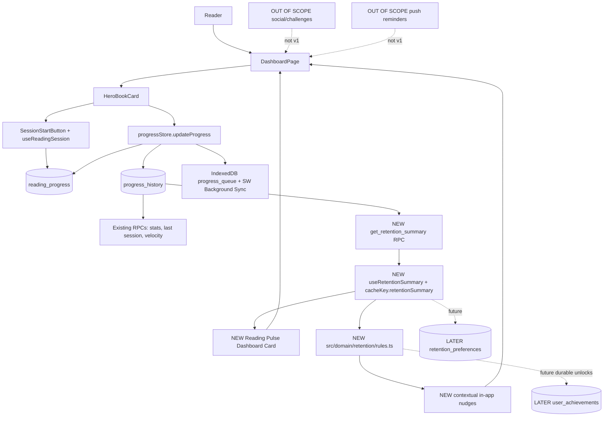

# Technical Sketch: Reading Retention Gamification

## In one sentence
An additive Dashboard rhythm layer that derives weekly reading momentum from confirmed `progress_history` sessions via one Supabase RPC, then surfaces goal progress, recovery nudges, and lightweight achievements through existing Vue/Pinia/SWR patterns.

## How it fits

## Chosen direction
- Keep `progress_history.session_start_at` as the canonical session event; no new session/event table for v1.
- Add one read-only `get_retention_summary(p_user_id, p_timezone)` RPC only if existing stats RPCs cannot be extended cleanly; no new tables for v1.
- Add `useRetentionSummary` on the client using the existing SWR cache and invalidate it after successful progress/session completion.
- Make gamification a Dashboard companion surface: Reading Pulse, tiny next action, comeback state, and sparse local celebrations.

## Alternatives considered
| Approach | Why not |
|----------|---------|
| Client-only weekly math | Duplicates timezone/session semantics and will diverge on mobile. |
| New sessions table | Unneeded while `progress_history` already records confirmed session completions. |
| XP/leaderboard system | Optimizes comparison and vanity behavior instead of sessions per week. |
| Push reminders first | Adds permissions, token storage, privacy surface, and unreliable web scheduling before the loop is proven. |

## Boundaries
- **Touches:** `DashboardPage.vue`, dashboard components, `progressStore` invalidation, `useCache`, existing Supabase RPC layer, shared retention types.
- **Owns:** `useRetentionSummary.ts`, `src/domain/retention/rules.ts`, Reading Pulse card/nudge presentation; optionally one additive read-only retention RPC.
- **Does not touch:** email/payments, AI edge functions, social/public profiles, push infrastructure, completion archive semantics, existing recap/lore/passport generation.

## Hard constraints
- Weekly session counts come from server-confirmed `progress_history`, not app opens or queued offline state.
- V1 should avoid Supabase structural changes beyond an additive read-only RPC or small extension to an existing stats RPC.
- Default goal is 3 sessions/week but must be editable once exposed as a real setting.
- Browser timezone is passed into v1 RPC; persisted timezone belongs with later preferences.
- RLS remains user-scoped; no retention table or RPC can expose another reader's behavior.
- Offline UI may be optimistic, but durable counts and unlocks wait for sync/revalidation.

## What this rules out for UX
- No strict daily streak as the primary mechanic.
- No failure, debt, penalty, or guilt copy after missed reading.
- No public rankings by pages, speed, books, or XP.
- No mandatory challenges before the weekly rhythm loop proves useful.
- No notification permission prompt from the first gamification surface.
