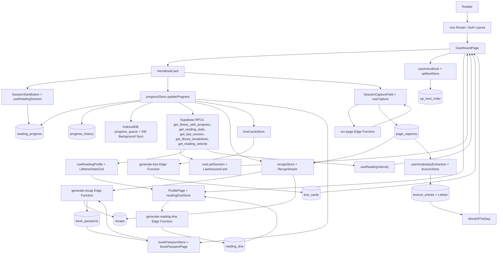

# Research: Codebase Retention Survey

**Agent:** codebase-survey
**Objective:** What does the current codebase already do that touches reading retention/gamification? Map files, modules, data models, and flows. Produce a Mermaid diagram.

## Findings

1. The app already treats the Dashboard as the retention home base. Routes expose Dashboard, Library, Add Book, Book Detail, Recap History, Great Library/Lexicon, Book Passport, and Profile under the authenticated layout (`src/router/index.ts:14`, `src/router/index.ts:19`, `src/router/index.ts:29`, `src/router/index.ts:35`, `src/router/index.ts:41`, `src/router/index.ts:46`, `src/router/index.ts:52`). The bottom nav makes Home, Library, Great Library, Profile, add-book, and sign-out persistent mobile actions (`src/components/shared/AppBottomNav.vue:14`, `src/components/shared/AppBottomNav.vue:15`, `src/components/shared/AppBottomNav.vue:18`, `src/components/shared/AppBottomNav.vue:19`, `src/components/shared/AppBottomNav.vue:38`, `src/components/shared/AppBottomNav.vue:79`, `src/components/shared/AppBottomNav.vue:90`, `src/components/shared/AppBottomNav.vue:98`).

2. Dashboard composes most retention-adjacent affordances in one page: active hero, in-progress list, up-next list, completed shelf, last-session card, Word of the Day, recap stream, session capture, and onboarding states. Imports show the surface area (`src/pages/DashboardPage.vue:16`, `src/pages/DashboardPage.vue:17`, `src/pages/DashboardPage.vue:18`, `src/pages/DashboardPage.vue:19`, `src/pages/DashboardPage.vue:20`, `src/pages/DashboardPage.vue:21`), mount loads library/progress/order/recaps/lore/lexicon (`src/pages/DashboardPage.vue:136`, `src/pages/DashboardPage.vue:139`, `src/pages/DashboardPage.vue:145`, `src/pages/DashboardPage.vue:150`), and render slots place hero, WotD, Last Session, In Progress, Up Next, and Completed (`src/pages/DashboardPage.vue:319`, `src/pages/DashboardPage.vue:351`, `src/pages/DashboardPage.vue:359`, `src/pages/DashboardPage.vue:367`, `src/pages/DashboardPage.vue:377`, `src/pages/DashboardPage.vue:391`).

3. The active-book mechanic is ephemeral but explicit. `useActiveBook` owns a module-scoped `activeBookId`, excludes the active book from Up Next, lets explicit swaps win, and auto-promotes only when the completed book is the current hero (`src/composables/useActiveBook.ts:12`, `src/composables/useActiveBook.ts:18`, `src/composables/useActiveBook.ts:37`, `src/composables/useActiveBook.ts:65`, `src/composables/useActiveBook.ts:76`, `src/composables/useActiveBook.ts:87`). Dashboard wires completion to `onBookCompleted` after progress crosses 100% (`src/pages/DashboardPage.vue:207`, `src/pages/DashboardPage.vue:219`, `src/pages/DashboardPage.vue:228`).

4. First-run onboarding already separates no-book, one-queued, one-active, completed-only, and default states without new storage. `useDashboardOnboardingState` derives queued, active, and completed counts from current stores (`src/composables/useDashboardOnboardingState.ts:20`, `src/composables/useDashboardOnboardingState.ts:21`, `src/composables/useDashboardOnboardingState.ts:28`, `src/composables/useDashboardOnboardingState.ts:45`, `src/composables/useDashboardOnboardingState.ts:57`, `src/composables/useDashboardOnboardingState.ts:69`). Dashboard empty/completed-only components frame "Start reading", "Add another", and completed archive prompts (`src/components/dashboard/DashboardEmptyState.vue:23`, `src/components/dashboard/DashboardEmptyState.vue:35`, `src/components/dashboard/DashboardEmptyState.vue:43`, `src/components/dashboard/DashboardEmptyState.vue:48`, `src/components/dashboard/CompletedOnlyState.vue:24`, `src/components/dashboard/CompletedOnlyState.vue:26`, `src/components/dashboard/CompletedOnlyState.vue:31`).

5. Add-book onboarding supports initial status choices that affect retention data side effects. `BookForm` exposes `Want to read`, `Read now`, and `Already finished` (`src/components/books/BookForm.vue:30`, `src/components/books/BookForm.vue:32`, `src/components/books/BookForm.vue:33`, `src/components/books/BookForm.vue:35`, `src/components/books/BookForm.vue:129`), `AddBookPage` sends `initialStatus` and routes active books to Dashboard (`src/pages/AddBookPage.vue:57`, `src/pages/AddBookPage.vue:64`, `src/pages/AddBookPage.vue:69`), and `booksStore.addBookWithInitialStatus` only creates initial progress for non-queued books (`src/stores/books.ts:192`, `src/stores/books.ts:200`, `src/stores/books.ts:207`, `src/stores/books.ts:210`). `progressStore.setInitialProgress` intentionally bypasses sessions, history, capture prompts, lore, recaps, and passports for imports (`src/stores/progress.ts:224`, `src/stores/progress.ts:225`, `src/stores/progress.ts:226`, `src/stores/progress.ts:228`).

6. Reading sessions are first-class but lightweight. `useReadingSession` derives active state from server-confirmed `session_start_at`, runs a local elapsed timer, blocks starting sessions offline, and delegates start/clear to `progressStore` (`src/composables/useReadingSession.ts:12`, `src/composables/useReadingSession.ts:30`, `src/composables/useReadingSession.ts:45`, `src/composables/useReadingSession.ts:66`, `src/composables/useReadingSession.ts:71`, `src/composables/useReadingSession.ts:73`, `src/composables/useReadingSession.ts:75`, `src/composables/useReadingSession.ts:83`). The start button renders elapsed active-session state (`src/components/session/SessionStartButton.vue:15`, `src/components/session/SessionStartButton.vue:22`, `src/components/session/SessionStartButton.vue:32`, `src/components/session/SessionStartButton.vue:39`, `src/components/session/SessionStartButton.vue:55`).

7. Progress writes are the core event stream for retention. `progressStore.updateProgress` performs optimistic updates, writes/upserts `reading_progress`, inserts `progress_history`, clears active `session_start_at`, invalidates aggregate caches, emits `lastSessionEnded`, detects milestone crossings, and falls back to offline queueing (`src/stores/progress.ts:287`, `src/stores/progress.ts:292`, `src/stores/progress.ts:297`, `src/stores/progress.ts:338`, `src/stores/progress.ts:343`, `src/stores/progress.ts:351`, `src/stores/progress.ts:357`, `src/stores/progress.ts:370`, `src/stores/progress.ts:390`, `src/stores/progress.ts:392`, `src/stores/progress.ts:416`, `src/stores/progress.ts:439`, `src/stores/progress.ts:443`). Session notes are a small reflection hook attached to `progress_history` (`src/stores/progress.ts:270`, `src/stores/progress.ts:273`, `src/stores/progress.ts:278`).

8. The database model already contains most primitives needed for motivation analytics. Base tables include `books`, `reading_progress`, and `recaps` (`specs/001-the-chronicler/contracts/supabase-schema.sql:9`, `specs/001-the-chronicler/contracts/supabase-schema.sql:33`, `specs/001-the-chronicler/contracts/supabase-schema.sql:68`); reading-suite tables add `up_next_order`, `progress_history`, `lexicon_entries`, `recap_fragments`, and `book_passports` (`specs/003-reading-suite-v3/contracts/supabase-schema.sql:10`, `specs/003-reading-suite-v3/contracts/supabase-schema.sql:25`, `specs/003-reading-suite-v3/contracts/supabase-schema.sql:41`, `specs/003-reading-suite-v3/contracts/supabase-schema.sql:66`, `specs/003-reading-suite-v3/contracts/supabase-schema.sql:84`). Later migrations add `session_start_at` and `session_note` (`supabase/migrations/20260424_session_stats.sql:5`, `supabase/migrations/20260424_session_stats.sql:8`, `supabase/migrations/20260424_session_stats.sql:10`), `lore_cards` (`supabase/migrations/20260417_lore_cards.sql:8`, `supabase/migrations/20260417_lore_cards.sql:17`, `supabase/migrations/20260417_lore_cards.sql:25`), `page_captures` (`supabase/migrations/20260426_corpus_recaps.sql:13`, `supabase/migrations/20260426_corpus_recaps.sql:24`, `supabase/migrations/20260426_corpus_recaps.sql:38`), `reading_dna` and `vocabulary_extractions` (`supabase/migrations/20260428_reader_profile.sql:23`, `supabase/migrations/20260428_reader_profile.sql:61`), and recap image metadata (`supabase/migrations/20260503_recap_image_columns.sql:8`, `supabase/migrations/20260503_recap_image_columns.sql:17`, `supabase/migrations/20260503_recap_image_columns.sql:68`).

9. TypeScript models mirror the retention data model. Key interfaces include `Book`, `ReadingProgress`, `Recap`, `OfflineProgressMutation`, `LibraryBookEntry`, `ReadingStats`, `LastSessionSummary`, `LibraryBreakdown`, `LexiconEntry`, `ReadingDna`, `ProgressHistory`, `BookPassport`, `LoreCard`, and `PageCapture` (`src/types/index.ts:5`, `src/types/index.ts:17`, `src/types/index.ts:36`, `src/types/index.ts:109`, `src/types/index.ts:143`, `src/types/index.ts:160`, `src/types/index.ts:172`, `src/types/index.ts:194`, `src/types/index.ts:278`, `src/types/index.ts:361`, `src/types/index.ts:405`, `src/types/index.ts:460`, `src/types/index.ts:516`, `src/types/index.ts:550`).

10. Server-side RPCs already produce habit metrics. `get_reading_stats` reads valid sessions from `progress_history`, builds streak groups, and returns `totalPagesRead`, `sessionsThisMonth`, `currentStreakDays`, and `longestStreakDays` (`supabase/migrations/20260502_rpc_performance_improvements.sql:60`, `supabase/migrations/20260502_rpc_performance_improvements.sql:78`, `supabase/migrations/20260502_rpc_performance_improvements.sql:84`, `supabase/migrations/20260502_rpc_performance_improvements.sql:92`, `supabase/migrations/20260502_rpc_performance_improvements.sql:133`, `supabase/migrations/20260502_rpc_performance_improvements.sql:142`, `supabase/migrations/20260502_rpc_performance_improvements.sql:148`, `supabase/migrations/20260502_rpc_performance_improvements.sql:156`). `useReadingProfile` consumes this RPC and exposes finished/in-progress book counts plus pages, streaks, and monthly sessions (`src/composables/useReadingProfile.ts:14`, `src/composables/useReadingProfile.ts:42`, `src/composables/useReadingProfile.ts:73`, `src/composables/useReadingProfile.ts:78`, `src/composables/useReadingProfile.ts:81`, `src/composables/useReadingProfile.ts:82`, `src/composables/useReadingProfile.ts:83`). `LifetimeStatsGrid` displays `Sessions this month`, `Current streak`, and `Longest streak` (`src/components/profile/LifetimeStatsGrid.vue:42`, `src/components/profile/LifetimeStatsGrid.vue:70`, `src/components/profile/LifetimeStatsGrid.vue:76`).

11. Last-session motivation is already built for Dashboard and hero-card follow-up. `get_last_session` computes latest progress row, previous page, duration, velocity, completion delta, finish prediction, and note (`supabase/migrations/20260502_rpc_performance_improvements.sql:168`, `supabase/migrations/20260502_rpc_performance_improvements.sql:182`, `supabase/migrations/20260502_rpc_performance_improvements.sql:187`, `supabase/migrations/20260502_rpc_performance_improvements.sql:217`, `supabase/migrations/20260502_rpc_performance_improvements.sql:238`, `supabase/migrations/20260502_rpc_performance_improvements.sql:239`, `supabase/migrations/20260502_rpc_performance_improvements.sql:243`, `supabase/migrations/20260502_rpc_performance_improvements.sql:244`, `supabase/migrations/20260502_rpc_performance_improvements.sql:270`). `useLastSession` wraps the RPC and refreshes when `lastSessionEnded` fires (`src/composables/useLastSession.ts:13`, `src/composables/useLastSession.ts:25`, `src/composables/useLastSession.ts:58`, `src/composables/useLastSession.ts:63`, `src/composables/useLastSession.ts:89`). `LastSessionCard` renders recency, pages range, duration, velocity, completion delta, and finish prediction (`src/components/dashboard/LastSessionCard.vue:20`, `src/components/dashboard/LastSessionCard.vue:28`, `src/components/dashboard/LastSessionCard.vue:34`, `src/components/dashboard/LastSessionCard.vue:40`, `src/components/dashboard/LastSessionCard.vue:48`, `src/components/dashboard/LastSessionCard.vue:58`, `src/components/dashboard/LastSessionCard.vue:63`, `src/components/dashboard/LastSessionCard.vue:74`). `HeroBookCard` also reacts to `lastSessionEnded` and can show session note/capture follow-up (`src/components/dashboard/HeroBookCard.vue:44`, `src/components/dashboard/HeroBookCard.vue:51`, `src/components/dashboard/HeroBookCard.vue:74`, `src/components/dashboard/HeroBookCard.vue:83`, `src/components/dashboard/HeroBookCard.vue:223`).

12. Reading velocity and finish prediction are separate from weekly motivation but can feed it. `get_reading_velocity` defines a 30-day rolling window over `progress_history` sessions and returns days-left estimates (`supabase/migrations/20260501_reading_velocity.sql:8`, `supabase/migrations/20260501_reading_velocity.sql:18`, `supabase/migrations/20260501_reading_velocity.sql:41`, `supabase/migrations/20260501_reading_velocity.sql:52`, `supabase/migrations/20260501_reading_velocity.sql:109`, `supabase/migrations/20260501_reading_velocity.sql:113`). `useReadingVelocity` caches the RPC per user and invalidates after session end (`src/composables/useReadingVelocity.ts:20`, `src/composables/useReadingVelocity.ts:30`, `src/composables/useReadingVelocity.ts:45`, `src/composables/useReadingVelocity.ts:67`, `src/composables/useReadingVelocity.ts:86`). Library cards display `Finish today!` or days-left copy (`src/components/library/ReadingWideCard.vue:28`, `src/components/library/ReadingWideCard.vue:73`, `src/components/books/BookCard.vue:24`, `src/components/books/BookCard.vue:89`).

13. Up Next is already ordered and optimistic, but it is not a goal/challenge system. `upNextStore` reads and writes `up_next_order`, uses SWR, and saves optimistic order with revert-on-error (`src/stores/upNext.ts:10`, `src/stores/upNext.ts:17`, `src/stores/upNext.ts:27`, `src/stores/upNext.ts:45`, `src/stores/upNext.ts:53`, `src/stores/upNext.ts:75`, `src/stores/upNext.ts:83`, `src/stores/upNext.ts:88`). This gives a queue/next-book affordance that could anchor weekly prompts, but no weekly target rows or campaign state exist in the code searched.

14. Recaps are a major retention loop: progress unlocks AI memory at intervals, recaps can use OCR captures, and completed recaps can get images. `useRecapLock` derives lock state from current progress and latest recap snapshot (`src/composables/useRecapLock.ts:16`, `src/composables/useRecapLock.ts:27`, `src/composables/useRecapLock.ts:48`, `src/composables/useRecapLock.ts:55`, `src/composables/useRecapLock.ts:61`). `recapsStore` fetches `recaps`, selects corpus mode when captures cover the delta, streams `generate-recap`, inserts the new recap, and requests image generation (`src/stores/recaps.ts:27`, `src/stores/recaps.ts:34`, `src/stores/recaps.ts:49`, `src/stores/recaps.ts:76`, `src/stores/recaps.ts:87`, `src/stores/recaps.ts:89`, `src/stores/recaps.ts:116`, `src/stores/recaps.ts:125`, `src/stores/recaps.ts:136`). The edge handler has inferred and corpus Gemini paths (`supabase/functions/generate-recap/handlers/recap.ts:15`, `supabase/functions/generate-recap/handlers/recap.ts:120`, `supabase/functions/generate-recap/handlers/recap.ts:176`, `supabase/functions/generate-recap/handlers/recap.ts:199`, `supabase/functions/generate-recap/handlers/recap.ts:219`, `supabase/functions/generate-recap/handlers/recap.ts:250`, `supabase/functions/generate-recap/handlers/recap.ts:272`). Recap history and cards show page/progress and corpus badges (`src/pages/RecapHistoryPage.vue:27`, `src/pages/RecapHistoryPage.vue:69`, `src/components/recap/RecapCard.vue:22`, `src/components/recap/RecapCard.vue:25`).

15. Lore cards are the closest existing "achievement unlock" system. `detectCrossedMilestone` turns progress percentage jumps into 10%-90% milestones (`src/utils/milestoneDetect.ts:2`, `src/utils/milestoneDetect.ts:8`, `src/utils/milestoneDetect.ts:12`, `src/utils/milestoneDetect.ts:34`, `src/utils/milestoneDetect.ts:42`). `lore_cards` enforces one card per user/book/milestone and has a `seen` flag (`supabase/migrations/20260417_lore_cards.sql:17`, `supabase/migrations/20260417_lore_cards.sql:24`, `supabase/migrations/20260417_lore_cards.sql:25`, `supabase/migrations/20260417_lore_cards.sql:49`). `loreCardsStore.maybeUnlockForMilestone` fetches existing lore, requires a master recap, calls `generate-lore`, inserts unseen cards, and later marks them seen (`src/stores/loreCards.ts:98`, `src/stores/loreCards.ts:108`, `src/stores/loreCards.ts:115`, `src/stores/loreCards.ts:140`, `src/stores/loreCards.ts:152`, `src/stores/loreCards.ts:161`, `src/stores/loreCards.ts:162`, `src/stores/loreCards.ts:187`, `src/stores/loreCards.ts:195`, `src/stores/loreCards.ts:213`). `LoreChronoscopeCard` and `LoreCardList` surface "Unlocked at X%" (`src/components/lore/LoreChronoscopeCard.vue:37`, `src/components/lore/LoreChronoscopeCard.vue:112`, `src/components/lore/LoreCardList.vue:76`, `src/components/lore/LoreCardList.vue:92`).

16. Book Passport is the completion trophy/archive loop. `bookPassportStore.fetchPassport` reads `book_passports`, `generatePassport` computes stats from `progress_history`, calls `generate-recap` in passport mode, and writes the passport (`src/stores/bookPassport.ts:18`, `src/stores/bookPassport.ts:25`, `src/stores/bookPassport.ts:40`, `src/stores/bookPassport.ts:56`, `src/stores/bookPassport.ts:58`, `src/stores/bookPassport.ts:99`, `src/stores/bookPassport.ts:134`, `src/stores/bookPassport.ts:138`). `BookPassportPage` displays days and vocabulary stats and uses Web Share API copy with days/read and new words (`src/pages/BookPassportPage.vue:23`, `src/pages/BookPassportPage.vue:31`, `src/pages/BookPassportPage.vue:32`, `src/pages/BookPassportPage.vue:33`, `src/pages/BookPassportPage.vue:74`, `src/pages/BookPassportPage.vue:78`, `src/pages/BookPassportPage.vue:121`). The edge passport handler streams Gemini output (`supabase/functions/generate-recap/handlers/passport.ts:10`, `supabase/functions/generate-recap/handlers/passport.ts:11`).

17. Lexicon/Word of the Day is a daily micro-retention loop. `lexiconStore` reads/writes `lexicon_entries`, resolves a daily WotD via localStorage cache, chooses due Leitner words before preview fallback, and updates Leitner state optimistically (`src/stores/lexicon.ts:17`, `src/stores/lexicon.ts:31`, `src/stores/lexicon.ts:41`, `src/stores/lexicon.ts:57`, `src/stores/lexicon.ts:71`, `src/stores/lexicon.ts:88`, `src/stores/lexicon.ts:128`, `src/stores/lexicon.ts:133`, `src/stores/lexicon.ts:153`, `src/stores/lexicon.ts:167`, `src/stores/lexicon.ts:176`, `src/stores/lexicon.ts:201`, `src/stores/lexicon.ts:220`). `useLeitner` defines 5 boxes, advancement/reset, and due-word selection (`src/composables/useLeitner.ts:4`, `src/composables/useLeitner.ts:15`, `src/composables/useLeitner.ts:16`, `src/composables/useLeitner.ts:21`, `src/composables/useLeitner.ts:28`, `src/composables/useLeitner.ts:30`). `WordOfTheDay` renders caught-up, preview, and review states and marks reviewed (`src/components/dashboard/WordOfTheDay.vue:15`, `src/components/dashboard/WordOfTheDay.vue:42`, `src/components/dashboard/WordOfTheDay.vue:57`, `src/components/dashboard/WordOfTheDay.vue:59`, `src/components/dashboard/WordOfTheDay.vue:76`, `src/components/dashboard/WordOfTheDay.vue:81`, `src/components/dashboard/WordOfTheDay.vue:106`).

18. Great Library/Lexicon search supports a habit-adjacent "collection" view. The composable runs server-side paginated search over `lexicon_entries`, supports book/type filters, and debounces text search (`src/composables/useGreatLibrarySearch.ts:2`, `src/composables/useGreatLibrarySearch.ts:30`, `src/composables/useGreatLibrarySearch.ts:82`, `src/composables/useGreatLibrarySearch.ts:113`, `src/composables/useGreatLibrarySearch.ts:125`, `src/composables/useGreatLibrarySearch.ts:220`, `src/composables/useGreatLibrarySearch.ts:221`, `src/composables/useGreatLibrarySearch.ts:234`). `GreatLibraryPage` uses intersection observer infinite scroll and hooks advance/reset actions to Leitner updates (`src/pages/GreatLibraryPage.vue:4`, `src/pages/GreatLibraryPage.vue:7`, `src/pages/GreatLibraryPage.vue:80`, `src/pages/GreatLibraryPage.vue:82`, `src/pages/GreatLibraryPage.vue:96`, `src/pages/GreatLibraryPage.vue:161`, `src/pages/GreatLibraryPage.vue:265`, `src/pages/GreatLibraryPage.vue:266`).

19. OCR capture turns real reading into recap/vocabulary memory. `useCapture` handles camera, offline/denied states, frame capture, and `ocr-page` POST (`src/composables/useCapture.ts:7`, `src/composables/useCapture.ts:10`, `src/composables/useCapture.ts:22`, `src/composables/useCapture.ts:31`, `src/composables/useCapture.ts:56`, `src/composables/useCapture.ts:59`, `src/composables/useCapture.ts:62`, `src/composables/useCapture.ts:69`, `src/composables/useCapture.ts:95`, `src/composables/useCapture.ts:135`). `capturesStore` caches/upserts `page_captures`, computes range coverage, and fire-and-forget triggers vocabulary extraction after save (`src/stores/captures.ts:10`, `src/stores/captures.ts:23`, `src/stores/captures.ts:26`, `src/stores/captures.ts:36`, `src/stores/captures.ts:47`, `src/stores/captures.ts:54`, `src/stores/captures.ts:76`, `src/stores/captures.ts:84`, `src/stores/captures.ts:95`, `src/stores/captures.ts:120`, `src/stores/captures.ts:126`). `SessionCaptureField` prompts after a real session and offers capture/note/skip plus offline state (`src/components/session/SessionCaptureField.vue:21`, `src/components/session/SessionCaptureField.vue:40`, `src/components/session/SessionCaptureField.vue:67`, `src/components/session/SessionCaptureField.vue:109`, `src/components/session/SessionCaptureField.vue:113`, `src/components/session/SessionCaptureField.vue:116`, `src/components/session/SessionCaptureField.vue:146`, `src/components/session/SessionCaptureField.vue:160`, `src/components/session/SessionCaptureField.vue:185`, `src/components/session/SessionCaptureField.vue:188`).

20. Auto-vocabulary extraction already links OCR to the lexicon loop. The migration adds `lexicon_entries.source` and `vocabulary_extractions` ledger (`supabase/migrations/20260428_reader_profile.sql:12`, `supabase/migrations/20260428_reader_profile.sql:13`, `supabase/migrations/20260428_reader_profile.sql:16`, `supabase/migrations/20260428_reader_profile.sql:61`, `supabase/migrations/20260428_reader_profile.sql:73`). `useVocabularyExtraction` inserts a ledger row, invokes `extract-vocabulary`, deduplicates against existing lexicon entries, inserts survivors with `leitner_box = 1`, `next_review_at`, and `source = auto`, then refreshes lexicon (`src/composables/useVocabularyExtraction.ts:13`, `src/composables/useVocabularyExtraction.ts:15`, `src/composables/useVocabularyExtraction.ts:18`, `src/composables/useVocabularyExtraction.ts:60`, `src/composables/useVocabularyExtraction.ts:82`, `src/composables/useVocabularyExtraction.ts:118`, `src/composables/useVocabularyExtraction.ts:150`, `src/composables/useVocabularyExtraction.ts:161`, `src/composables/useVocabularyExtraction.ts:162`, `src/composables/useVocabularyExtraction.ts:164`, `src/composables/useVocabularyExtraction.ts:167`, `src/composables/useVocabularyExtraction.ts:186`). The edge prompt selects up to five uncommon/literary words (`supabase/functions/extract-vocabulary/index.ts:25`).

21. Reader Profile is already a "identity/progress" retention surface. `ProfilePage` loads library with progress, DNA, stats, and breakdown in parallel, then maybe generates DNA after threshold (`src/pages/ProfilePage.vue:13`, `src/pages/ProfilePage.vue:20`, `src/pages/ProfilePage.vue:26`, `src/pages/ProfilePage.vue:29`, `src/pages/ProfilePage.vue:32`, `src/pages/ProfilePage.vue:38`, `src/pages/ProfilePage.vue:84`, `src/pages/ProfilePage.vue:87`, `src/pages/ProfilePage.vue:90`). `readingDnaStore` fetches persisted DNA, checks a finished-books threshold, invokes `generate-reading-dna`, and upserts results (`src/stores/readingDna.ts:31`, `src/stores/readingDna.ts:45`, `src/stores/readingDna.ts:60`, `src/stores/readingDna.ts:61`, `src/stores/readingDna.ts:70`, `src/stores/readingDna.ts:86`, `src/stores/readingDna.ts:96`, `src/stores/readingDna.ts:108`). `ReadingDnaCard` shows a threshold progress bar until enough books are finished, then mood/personality/suggestions (`src/components/profile/ReadingDnaCard.vue:2`, `src/components/profile/ReadingDnaCard.vue:17`, `src/components/profile/ReadingDnaCard.vue:32`, `src/components/profile/ReadingDnaCard.vue:35`, `src/components/profile/ReadingDnaCard.vue:39`, `src/components/profile/ReadingDnaCard.vue:41`, `src/components/profile/ReadingDnaCard.vue:63`, `src/components/profile/ReadingDnaCard.vue:69`).

22. SWR caching is already centralized and auth-safe. `cacheKeys` include books, progress, recaps, lore, lexicon, up-next, captures, library, readingStats, lastSession, libraryBreakdown, and velocity (`src/composables/useCache.ts:185`, `src/composables/useCache.ts:187`, `src/composables/useCache.ts:190`, `src/composables/useCache.ts:192`, `src/composables/useCache.ts:196`, `src/composables/useCache.ts:197`, `src/composables/useCache.ts:198`, `src/composables/useCache.ts:199`, `src/composables/useCache.ts:201`). `clearAll` is called when the authenticated user changes (`src/composables/useCache.ts:130`, `src/composables/useCache.ts:132`, `src/stores/auth.ts:38`, `src/stores/auth.ts:45`). This matters for gamification because weekly-session aggregates can reuse the same cache/revalidation pattern.

23. PWA/offline affordances are scoped to progress persistence, not full offline app parity. Vite PWA uses injectManifest and a custom manifest (`vite.config.ts:14`, `vite.config.ts:17`, `vite.config.ts:18`, `vite.config.ts:21`); the service worker precaches assets, cache-firsts static assets, network-firsts navigation, and sends `FLUSH_PROGRESS_QUEUE` on Background Sync tag `progress-sync` (`src/sw.ts:2`, `src/sw.ts:10`, `src/sw.ts:14`, `src/sw.ts:23`, `src/sw.ts:34`, `src/sw.ts:35`, `src/sw.ts:43`). `useOfflineSync` stores progress mutations in IndexedDB `chronicler-offline/progress_queue`, drains them in order, and registers background sync (`src/composables/useOfflineSync.ts:2`, `src/composables/useOfflineSync.ts:12`, `src/composables/useOfflineSync.ts:13`, `src/composables/useOfflineSync.ts:18`, `src/composables/useOfflineSync.ts:31`, `src/composables/useOfflineSync.ts:60`, `src/composables/useOfflineSync.ts:76`, `src/composables/useOfflineSync.ts:82`, `src/composables/useOfflineSync.ts:91`, `src/composables/useOfflineSync.ts:96`). `HeroBookCard` shows pending-sync status (`src/components/dashboard/HeroBookCard.vue:186`, `src/components/dashboard/HeroBookCard.vue:188`).

24. Gaps for reading-retention gamification: there is no explicit weekly goal, weekly challenge, target sessions per week, achievement/badge table, streak-freeze/rest-day model, social feed, public profile, leaderboard, notification/reminder scheduler, or shareable weekly recap found in `src`, `supabase`, or `specs` searches. Existing weekly-adjacent data is available indirectly from `progress_history.session_start_at`, `get_reading_stats.sessionsThisMonth`, current/longest streaks, `get_last_session`, and `get_reading_velocity`, but not as a dedicated weekly-session aggregate or persistent goal state (`supabase/migrations/20260424_session_stats.sql:8`, `supabase/migrations/20260502_rpc_performance_improvements.sql:142`, `supabase/migrations/20260502_rpc_performance_improvements.sql:148`, `supabase/migrations/20260502_rpc_performance_improvements.sql:156`, `supabase/migrations/20260502_rpc_performance_improvements.sql:168`, `supabase/migrations/20260501_reading_velocity.sql:18`). The nearest gamification primitives are lore milestones, Reading DNA thresholds, Book Passport completion sharing, WotD/Leitner due reviews, Last Session feedback, and streak/monthly session stats.

## Diagram

## Implications for This Context

- Prototype weekly-session motivation should build on `progress_history.session_start_at` as the canonical "session happened" event, because all existing Last Session, streak, velocity, and stats logic already treats session-backed progress rows as meaningful.
- The fastest path is likely a new weekly aggregate/read model or RPC over `progress_history`, then a Dashboard/Profile component using existing SWR cache patterns. Existing `get_reading_stats` only returns `sessionsThisMonth`, not sessions this week or per-week trend.
- The app already has motivational language patterns: Last Session feedback, Book Passport sharing, Reading DNA threshold progress, WotD review, days-left estimates, and lore milestone unlocks. A gamification layer should reuse those surfaces before inventing new navigation.
- Existing "achievement" infrastructure is book-progress-scoped (`lore_cards`) and completion-scoped (`book_passports`), not habit-scoped. Weekly-session motivation will need a new concept if persistence, history, celebrations, or badges matter.
- Offline progress queueing means session completions can eventually sync, but starting sessions and camera/OCR require online paths. Weekly-session counts should account for queued progress updates and late-arriving `progress_history` rows.
- There is no current social/Strava-like graph or public leaderboard surface; Book Passport uses native share text only. Social motivation would be new product and data-model territory.

## References and Sources

- `src/router/index.ts`
- `src/pages/DashboardPage.vue`
- `src/components/dashboard/HeroBookCard.vue`
- `src/components/dashboard/LastSessionCard.vue`
- `src/components/dashboard/WordOfTheDay.vue`
- `src/composables/useActiveBook.ts`
- `src/composables/useDashboardOnboardingState.ts`
- `src/composables/useReadingSession.ts`
- `src/composables/useLastSession.ts`
- `src/composables/useReadingProfile.ts`
- `src/composables/useReadingVelocity.ts`
- `src/composables/useLibraryBreakdown.ts`
- `src/composables/useOfflineSync.ts`
- `src/composables/useCache.ts`
- `src/stores/progress.ts`
- `src/stores/books.ts`
- `src/stores/upNext.ts`
- `src/stores/recaps.ts`
- `src/stores/loreCards.ts`
- `src/stores/bookPassport.ts`
- `src/stores/lexicon.ts`
- `src/stores/captures.ts`
- `src/stores/readingDna.ts`
- `src/services/recapService.ts`
- `src/services/loreService.ts`
- `src/sw.ts`
- `vite.config.ts`
- `supabase/migrations/20260417_lore_cards.sql`
- `supabase/migrations/20260424_session_stats.sql`
- `supabase/migrations/20260426_corpus_recaps.sql`
- `supabase/migrations/20260428_reader_profile.sql`
- `supabase/migrations/20260501_reading_velocity.sql`
- `supabase/migrations/20260502_rpc_performance_improvements.sql`
- `supabase/migrations/20260503_recap_image_columns.sql`
- `supabase/functions/generate-recap/handlers/recap.ts`
- `supabase/functions/generate-recap/handlers/passport.ts`
- `supabase/functions/generate-lore/index.ts`
- `supabase/functions/ocr-page/index.ts`
- `supabase/functions/extract-vocabulary/index.ts`
- `supabase/functions/generate-reading-dna/index.ts`
- `specs/001-the-chronicler/contracts/supabase-schema.sql`
- `specs/003-reading-suite-v3/contracts/supabase-schema.sql`
