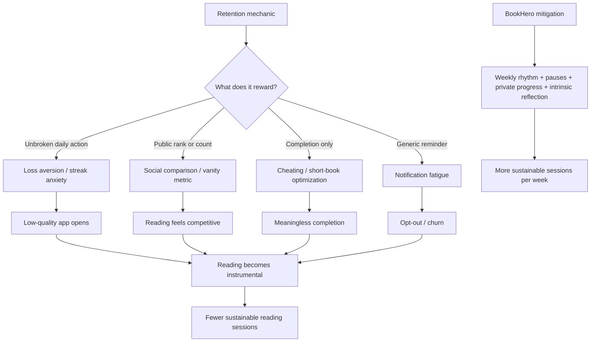

# Research: Failure Modes for Reading Gamification

**Agent:** failure-modes
**Objective:** What anti-patterns and known failures should BookHero avoid when adding retention/gamification mechanics?

## Findings

| Failure mode | Documented pattern | Why it fails | Mitigation for BookHero |
| --- | --- | --- | --- |
| Streak anxiety | Duolingo says streaks are one of its strongest return drivers, with nearly 8 million users at 365+ days, and extends the mechanic into Friend Streaks. Its own engineering blog documents streak freezes and outage protection for more than 2 million affected streaks. Apple added watchOS 11 ring pausing after years of criticism that Activity rings punished illness, travel, and rest days. | A daily all-or-nothing streak turns consistency into loss avoidance. Users keep the number alive with low-quality actions, feel trapped, or churn when the streak breaks. The Guardian's streak reporting includes Duolingo users describing "obligation," "vague anxiety," guilt, and relief after uninstalling. | Make "active weeks" the primary metric, not unbroken daily streaks. Count sessions-per-week toward a weekly rhythm. Include explicit rest/skip states: "planned pause," "busy week," "travel," "illness." Preserve identity as "reader in rhythm" after a miss. Never use red failure states for missed days. |
| Guilt loops | Apple Watch critiques describe ring nags and streak pressure that can make users exercise for the watch instead of recovery. Duolingo streak repair/freezes reduce the pain of failure but can also keep users paying attention to the broken metric. | Guilt can produce a short-term return but teaches users that BookHero is another obligation. Average readers and inconsistent readers are especially likely to associate the app with shame, then avoid opening it. | Use compassionate recovery copy: "Welcome back" over "You failed." After inactivity, offer a one-tap "restart gently" path: 5 minutes today, resume current book, or log offline reading. No debt mechanics: never ask users to "make up" missed reading. |
| Vanity metrics | C. Thi Nguyen's "value capture" critique: gamification flattens subtle values into numbers, then users internalize the number as the goal. The 2026 Guardian reading-goals piece applies this directly to reading: public counts become social currency even when they do not track whether a book changed the reader. | Book count, pages, XP, and rank are easy to optimize but weak proxies for meaningful reading. Users may choose shorter books, skim, log fake pages, or optimize for streak preservation instead of attention and enjoyment. | Treat metrics as scaffolding. Primary success should be "sessions this week" and "returning to a book," not total books. Secondary reflections should foreground intrinsic value: favorite passage, feeling, curiosity, "what stayed with you." Keep book-count leaderboards out of scope. |
| Notification fatigue | Mobile notification research repeatedly finds small average effects and high sensitivity to frequency/content. A 2018 JOOL Health study found response depended on content and prior usage; less active users were less likely to respond. A 2023 JMIR microrandomized trial found notifications can increase engagement but effects vary by recency/fatigue. Reuters Institute reporting on news alerts found many users disable alerts because they are too frequent or irrelevant. | Generic reminders punish the exact users BookHero wants to help: people already struggling with consistency. Repeated "read now" pushes become noise, then notification opt-out, then app disappearance. | Ship notification controls before notification volume. Let users choose reading windows, quiet days, and tone. Use sparse, context-aware prompts: "You usually read Sunday evening" or "Your book is at a natural stopping point." Stop prompting after repeated non-response. Avoid streak-threat notifications. |
| Low-signal badges | Gamification research on points, levels, and leaderboards is mixed: Mekler et al. found points/levels/leaderboards increased performance but did not themselves improve intrinsic motivation; the elements functioned mainly as progress indicators. | Badges for trivial actions become UI clutter. Users learn badges are noise, not recognition. Worse, they can imply that opening the app or tapping "complete" matters more than the reading session. | Award only for reader-meaningful milestones: "returned after a hard week," "finished first session with this book," "read across three weeks," "completed a long book over time." Keep badges sparse, private by default, and tied to effort quality or resilience rather than raw volume. |
| Cheating and meaningless completion | Strava's leaderboard culture creates incentives to misclassify activities; reports in 2026 describe millions of rides removed from leaderboards after suspected e-bike/vehicle uploads. Goodreads/reading challenge critiques note readers may pick short/easy books or rush to hit yearly targets. | If completion produces status, completion will be gamed. Reading is easy to fake because BookHero cannot verify physical book pages. Tight completion rewards make "mark complete" a target independent of actual reading. | Do not make completion the central competitive unit. Prefer progress confidence bands and user-owned logs. Allow abandoning, pausing, rereading, and sampling without penalty. Reward honest state changes: "set aside for now" should keep momentum. If social features arrive, never rank completions. |
| Over-social comparison | Leaderboards rely on social comparison. Research notes upward comparison can motivate but can also threaten self-view; newer gamification research links competitive tracking to envy/resentment in workplaces. Strava's KOM/QOM and leaderboard culture show how social status can dominate the original activity. | Average readers compare themselves against power readers, BookTok volume, or friends with different life constraints. Comparison makes inconsistent readers feel behind before they have built a habit. | Use social as support, not ranking. Support private profiles first. If social ships later, use opt-in small circles, encouragement, buddy check-ins, and shared intentions. Compare users to their own baseline: "2 sessions more than last week" beats "bottom 20%." |
| Instrumentalizing reading | The Guardian reading-goals piece names the core risk: reading becomes productivity. StoryGraph's founder positioned the product against social-media competition, offering page/time/habit goals and open-ended challenges so users are not punished for curiosity or long books. | Reading becomes another quantified task. Users optimize away from slow, difficult, weird, or emotionally resonant books because they reduce throughput. For struggling readers, this can turn reading into a chore again. | Frame BookHero as a companion, not a scorekeeper. Use goals that preserve choice: time spent, pages touched, days returned, genres explored, books tried. Make "slow reading," "rereading," "DNF with reason," and "reading a hard chapter" legitimate progress. |
| One-size-fits-all goals | Apple now lets users pause Activity rings and set different goals by day of week. Before that, daily rings assumed every day should be equivalent. Reading habits are even more variable: commute days, weekends, school terms, parenting, health, and attention cycles. | Fixed daily goals punish normal life. Users either lower the goal until it is meaningless or miss repeatedly and disengage. | Let users set rhythm patterns: weekdays only, weekend reader, 3 sessions/week, bedtime-only, variable goal. Detect current baseline and suggest small increments. Make the goal editable without shame. |
| Punishing long books and difficult formats | Book-count goals favor novellas, audiobooks counted inconsistently, and easy genres. StoryGraph's page/time goals are a mitigation because partial reading effort counts and long books are not punished as harshly. | Users learn the system values finishing many units, not staying with challenging work. This distorts book choice and makes slow progress invisible. | Support pages, percent, time, audio minutes, and "chapter/session" logging. Normalize partial progress. Use "effort this week" and "return rate" rather than "books finished this month." |
| Dark-pattern recovery monetization | Streak freezes can be forgiving, but when tied to currencies, urgency, or repair flows they can become a monetized anxiety sink. Duolingo-style proactive freezes and repair prompts show the product pattern. | Users perceive the app as exploiting sunk cost. In a reading companion, this damages trust faster than it improves retention. | If BookHero has streak protection, make it free, transparent, and user-controlled. Prefer "pause rhythm" over "buy freeze." Never attach paid features to avoiding shame or preserving identity. |
| Metric drift from north-star | North-star is more sessions per week. Product teams can accidentally optimize for daily opens, notification taps, badge claims, or completion count because they are easier to measure. | The app may look more engaged while users read less or feel worse. Daily micro-actions can inflate analytics without increasing meaningful reading sessions. | Instrument hierarchy: primary = reading sessions/week; guardrails = self-reported pressure, notification opt-out, session length distribution, abandoned goal rate, false completion signals. Review retention mechanics against "did this create a real session?" |

## Diagram (if applicable)

## Implications for This Context

- Optimize for weekly rhythm, not daily perfection. BookHero's north-star is more sessions per week; a 3-session week after a missed day is success.
- Build "rest and return" as first-class product language. Apple Fitness' ring pause is a strong reference: recovery protects streaks without pretending the user progressed.
- Use gamification as feedback, not status. Mekler et al. support points/levels as progress indicators; Nguyen's critique warns against letting the score replace the activity's value.
- Avoid global leaderboards. Strava-style competition is powerful for athletes with shared routes and measurable performance; reading has weaker verification, more private value, and bigger intimidation risk for average readers.
- Make badges rare and legible. Each badge should answer: "What reader behavior do we want more of because it predicts a real reading session?"
- Let users log honestly. Abandoned books, slow books, rereads, audiobooks, and partial sessions must all count. If only completion counts, users will optimize completion.
- Notifications should be a contract. Ask when and how to remind; stop when ignored; never threaten a streak. Prototype web/PWA reminders with explicit opt-in and quiet defaults before mobile push volume.
- Add guardrail metrics during prototype: notification opt-out, "felt pressured" feedback, goal edits downward, streak break churn, suspicious instant-completion events, and ratio of app opens to logged reading sessions.

## References and Sources

- Duolingo Blog, "Friend Streak Is Duolingo's Latest Social Feature" - streaks as a major return mechanic and 365-day streak scale: https://blog.duolingo.com/friend-streak/
- Duolingo Blog, "Protecting streaks from site issues" - streak freeze/outage protection pattern: https://blog.duolingo.com/protecting-streaks-from-site-issues/
- Apple Newsroom, "watchOS 11 brings powerful health and fitness insights" - activity ring pausing and day-specific goals: https://www.apple.com/newsroom/2024/06/watchos-11-brings-powerful-health-and-fitness-insights/
- Apple Support, "Adjust your Activity ring goals on Apple Watch" - pause rings without breaking award streaks: https://support.apple.com/en-tj/guide/watch/apd29b30023c/watchos
- The Guardian, "Don't break the streak! How a daily ritual can enrich your life - or become an unhealthy obsession" - user accounts of Duolingo anxiety/guilt loops: https://www.theguardian.com/lifeandstyle/article/2024/sep/08/streak-daily-ritual-can-enrich-your-life-or-become-unhealthy-obsession
- The Guardian, "'Last year I read 137 books': could setting targets help you put down your phone and pick up a book?" - reading goal pressure, StoryGraph positioning, Nguyen value-capture framing: https://www.theguardian.com/books/2026/feb/21/last-year-i-read-137-books-could-setting-targets-help-you-put-down-your-phone-and-pick-up-a-book
- C. Thi Nguyen, "Gamification and Value Capture," in *Games: Agency as Art* - quantification/value-capture critique: https://philpapers.org/rec/NGUGAV
- Wang, Jia, and Jin, "Reading Amount and Reading Strategy as Mediators of the Effects of Intrinsic and Extrinsic Reading Motivation on Reading Achievement," *Frontiers in Psychology* - intrinsic reading motivation predicts reading amount; extrinsic motivation can have negative direct relation to achievement: https://pmc.ncbi.nlm.nih.gov/articles/PMC7652739/
- Deci, Koestner, and Ryan, "Extrinsic Rewards and Intrinsic Motivation in Education: Reconsidered Once Again," *Review of Educational Research* - expected tangible rewards can undermine intrinsic motivation: https://journals.sagepub.com/doi/pdf/10.3102/00346543071001001
- Mekler, Bruehlmann, Opwis, and Tuch, "Do points, levels and leaderboards harm intrinsic motivation?" - points/levels/leaderboards increased performance but did not improve intrinsic motivation in the studied task: https://research.aalto.fi/en/publications/do-points-levels-and-leaderboards-harm-intrinsic-motivation-an-em
- Bell et al., "How Notifications Affect Engagement With a Behavior Change App," *JMIR mHealth and uHealth* - notification effects vary by timing/recency/fatigue: https://mhealth.jmir.org/2023/1/e38342
- Bidargaddi et al., "Predicting which type of push notification content motivates users to engage in a self-monitoring app," *Preventive Medicine Reports* - content and prior usage affect notification response: https://pmc.ncbi.nlm.nih.gov/articles/PMC6080195/
- Kamal et al., "Is identifying boredom the answer to controlling the bombardment of notifications on mobile devices?" - notification overload/interruption fatigue: https://link.springer.com/article/10.1007/s42486-023-00143-8
- The Guardian, "Rise in alert fatigue risks phone users disabling news notifications, study finds" - Reuters Institute reporting on notification opt-out from frequency/irrelevance: https://www.theguardian.com/media/2025/jun/20/increase-alert-fatigue-phone-users-disable-news-notifications-study-finds
- Cycling Weekly, "Strava removes 2.3 million rides from leaderboards in clampdown on cheats" - leaderboard incentives and integrity cleanup: https://www.cyclingweekly.com/news/strava-removes-2-3-million-rides-from-leaderboards-in-clampdown-on-cheats
- The Guardian, "Kudos, leaderboards, QOMs: how fitness app Strava became a religion" - social comparison, status, and performance culture in Strava: https://www.theguardian.com/news/2020/jan/14/kudos-leaderboards-qoms-how-fitness-app-strava-became-a-religion
- Zhang, van Horen, and Zeelenberg, "Increasing saving intentions through leaderboards," *PLOS ONE* - leaderboards work through social comparison and can threaten self-view under upward comparison: https://pmc.ncbi.nlm.nih.gov/articles/PMC8046219/
- van Zoonen, "From Motivation to Resentment: Gamification and the Envy Dilemma," *Group & Organization Management* - competitive metrics can fuel envy/resentment: https://journals.sagepub.com/doi/10.1177/10596011261416728
