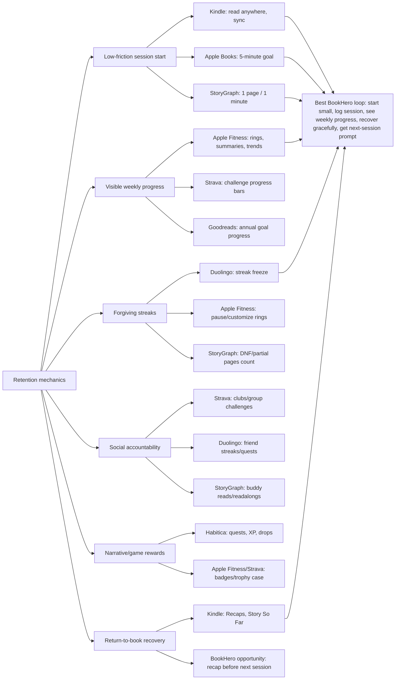

# Research: Market Retention Solutions

**Agent:** market-solutions
**Objective:** What existing products solve reading/fitness/habit retention? How does each approach return behavior, and what transfers to BookHero?

## Findings

### StoryGraph

| Mechanic | How StoryGraph uses it | Fit for BookHero sessions/week |
|---|---|---|
| Reading challenges | Public challenge directory, hosted prompts, annual and themed goals. Examples in 2026 include official onboarding, genre, "Reads the World", and January Pages challenges with large participant counts. | Strong fit if challenges reward reading occasions, not just completions. "Read 4 days this week" fits consistency better than "finish 12 books." |
| Page/minute daily challenge | January Pages Challenge asks users to read at least one page or listen to one minute every day in January. | Very strong fit. Low minimum lowers activation energy for struggling readers; a micro-session can preserve identity without forcing long reads. |
| Progress-aware page goals | StoryGraph shipped page-by-page tracking so long books and DNFs count toward goals. | Strong fit. BookHero should count partial progress and short sessions so users are not punished for difficult books, rereads, or abandoning a bad fit. |
| Buddy reads/readalongs | Buddy reads support up to 15 people; readalongs support larger groups with checkpoint forums. Comments are locked until participants reach that point. | Medium fit for prototype; high fit later. Spoiler-safe checkpoints are excellent for reading, but social graph and moderation costs are high. Start with private "reading pact" between two users or solo checkpoint prompts. |
| Mood/pace recommendation | Recommendations and filters center on mood, pace, genre, and personal taste. | Medium fit. Helps restart stalled readers by reducing "what next?" friction, but does not directly create weekly sessions unless paired with session prompts. |

Transfer lesson: StoryGraph is strongest where it respects reading as uneven, personal, and book-length dependent. BookHero should copy page/minute/session goals and spoiler-safe checkpoints, not only annual book counts.

### Goodreads

| Mechanic | How Goodreads uses it | Fit for BookHero sessions/week |
|---|---|---|
| Annual Reading Challenge | Users set a yearly book target, track progress, and celebrate completion. Goodreads recommends realistic goals and calendar-based targets like 12, 24, or 52 books. | Weak-to-medium fit. Useful for identity and long-range motivation, but book counts are a lagging metric and can incentivize shorter/easier books. Poor direct lever for sessions/week. |
| Social shelves/reviews | Want to Read shelf, ratings, reviews, friend activity, recommendations. | Medium fit. Social proof and next-book queues reduce drop-off after a book, but can become browsing instead of reading. |
| Adjustable goals | Goodreads explicitly frames goals as flexible and user-owned. | Strong fit as a principle. BookHero should let readers lower a weekly session target without shame, especially after missed weeks. |

Transfer lesson: Goodreads shows annual goals are familiar, but they are too coarse for BookHero's success metric. Use yearly/monthly book goals as secondary context; make weekly reading sessions the primary loop.

### Kindle

| Mechanic | How Kindle uses it | Fit for BookHero sessions/week |
|---|---|---|
| Read anywhere | Kindle app positions phone/tablet access as "never be without a book"; syncs place, notes, highlights across devices. | Very strong fit conceptually. BookHero cannot control the reading surface for print/library books, so it must make logging a session almost as easy as opening Kindle. |
| Progress/time-left indicators | Kindle shows percent read, real pages for many titles, and time left in chapter/book based on reading speed. | Strong fit. "8 minutes left in chapter" is a better session prompt than "read more." BookHero can estimate "one more small step" from pages/chapter metadata when available. |
| Context recovery | Kindle Recaps and "Story So Far" help users return to books they set aside; Ask this Book gives spoiler-free answers. | Very strong fit. BookHero already has recap ambitions; retention value is not novelty but re-entry friction removal. "Resume without rereading" can increase weekly sessions. |
| Kindle Challenges/Reading Insights | Amazon has promoted Kindle reading goals and New Year challenges; some reading-stat features appear app-centric rather than e-reader-centric. | Medium fit. Challenges help, but fragmented device support is a caution: BookHero's gamification must work for print, ebook, audiobook, and offline capture. |

Transfer lesson: Kindle's best retention mechanic is convenience plus memory restoration. BookHero should treat "I forgot where I was" and "I do not have the book in hand" as return blockers.

### Apple Books

| Mechanic | How Apple Books uses it | Fit for BookHero sessions/week |
|---|---|---|
| Daily reading goal | Apple Books tracks daily reading minutes; default daily goal is 5 minutes if not customized. | Very strong fit. Five-minute default is prototype-friendly and aligned with struggling readers. |
| Streaks and records | Books celebrates daily goals, new streak records, and books read this year. | Strong fit if forgiving. A strict daily streak can demoralize inconsistent readers; weekly session streaks fit BookHero better. |
| Encouragement | Apple says Books gives encouragement to reach daily goals. | Strong fit. Nudge tone matters: "one page keeps the thread alive" beats guilt language. |
| Yearly books read | Books tracks finished books/audiobooks per year. | Medium fit. Good for recap and pride, not primary session driver. |

Transfer lesson: Apple Books validates a small daily-minute goal for reading. BookHero should adapt this into weekly cadence: e.g., "3 sessions this week, any length; 5 minutes counts."

### Apple Fitness / Apple Watch

| Mechanic | How Apple uses it | Fit for BookHero sessions/week |
|---|---|---|
| Activity rings | Move, Exercise, Stand rings show daily progress toward distinct goals. | Very strong pattern, with adaptation. BookHero can use multiple dimensions: Sessions, Pages/Minutes, Reflection/Recall. Avoid copying ring visual too literally. |
| Daily/weekly feedback | Apple Watch shows current totals, weekly summary, history, and Trends comparing recent 90 days to prior 365 days. | Strong fit later. Prototype can start with weekly summary: sessions, best reading window, average session length, current book momentum. |
| Awards | Awards for records, streaks, monthly challenges, competitions. | Medium-to-strong fit. Best for milestones: first 3-session week, comeback week, 4 weeks with any reading. Avoid trophy spam. |
| Reminders/coaching | Activity reminders tell users if they are on track or behind; coaching suggests concrete small actions like walking extra distance. | Very strong fit. BookHero should recommend a concrete next session: "Read 7 pages tonight to keep your 3-session week." |
| Sharing/competitions | Share rings, receive progress notifications, compete head-to-head for seven days. | Medium fit. Fitness tolerates competition better than reading. Use private accountability or cooperative goals before leaderboards. |
| Rest days / paused rings | Apple Fitness app supports customized rings and pausing for rest days in recent app listings. | Strong fit. Reading needs grace weeks, travel mode, illness mode, and "low-energy mode." |

Transfer lesson: Apple Fitness is the best model for daily/weekly feedback architecture: visible progress, small goals, coaching, awards, and recovery. Reading needs less competition and more permission to restart.

### Strava

| Mechanic | How Strava uses it | Fit for BookHero sessions/week |
|---|---|---|
| Challenges | Strava challenges can last one day, several days, or a month; goals include distance, elevation, time, matching a segment, or active days. Users can track progress and earn trophy-case badges. | Strong fit. BookHero can offer weekly/monthly reading challenges with active days, minutes, pages, or "return to paused book" goals. |
| Clubs | Clubs provide member feeds, leaderboards, and group identity around sports. | Medium fit later. Reading clubs fit naturally, but prototype should not depend on network effects. |
| Group challenges | Private group challenges let friends set goals and time windows, track each other, and see related activity/photos. | Medium-to-strong fit for small groups. "Family reading week" or "2-person book pact" transfers better than public leaderboards. |
| Feed notifications | Sponsored challenge material describes join/milestone notifications appearing in follower feeds. | Weak fit for BookHero prototype. Feed mechanics require social graph, privacy controls, moderation, and notification discipline. |
| Segment comparison | Strava segments turn routes into repeatable comparison surfaces. | Selective fit. Reading equivalent could be chapter checkpoints or "same book cohort" progress, but leaderboards by speed/pages can distort reading quality. |

Transfer lesson: Strava's transferable unit is not competition itself; it is opt-in, time-boxed, progress-visible challenges. BookHero should use "active days this week" and private cooperative challenges before public rankings.

### Duolingo

| Mechanic | How Duolingo uses it | Fit for BookHero sessions/week |
|---|---|---|
| Streak | Streak increases after the first lesson each day; it resets if no lesson is completed unless protected. Duolingo describes streaks as one of its most powerful return tools. | Strong but risky. Reading streaks can work if target is tiny and forgiving. Weekly streaks are safer than daily streaks for BookHero's audience. |
| Streak Freeze | Freeze prevents streak loss after a missed day if equipped before the miss. | Very strong fit as "grace tokens." BookHero can grant automatic weekly grace so inconsistent readers do not churn after one bad day. |
| Friend Streak | Shared streak with up to five friends; each friend streak is separate; users can nudge friends who have not done a lesson. | Medium fit. Useful for accountability pairs, but nudges can feel intrusive. Best as explicit opt-in "reading pact." |
| Friends Quests | Weekly random friend pairing, five-day challenge, shared reward; Duolingo says learners who follow friends are 5.6x more likely to finish their course. | Medium-to-strong fit later. Weekly cooperative quests map well to sessions/week: "together complete 6 reading sessions by Sunday." |
| Leagues/XP economy | Competitive XP rankings and rewards. | Weak fit. Reading quality is hard to compare; XP can incentivize logging noise and short-form optimization. |
| Widgets/reminders | Streak visible on mobile home/lock screen; reminders protect the daily habit. | Strong fit for later mobile. Prototype can emulate with dashboard-first session card; native widgets later. |

Transfer lesson: Duolingo proves tiny daily actions, streak protection, and social accountability drive return behavior. BookHero should borrow streak freeze and friend quests, not XP pressure.

### Habitica

| Mechanic | How Habitica uses it | Fit for BookHero sessions/week |
|---|---|---|
| Dailies | Scheduled repeat tasks; completing them grants XP, gold, mana, drops, and streak progress. Missing due dailies costs health and resets streaks. | Mixed fit. Scheduled reading tasks are useful; punitive health loss is poor for readers struggling with consistency. |
| Habits, To-Dos, Rewards | User-created habit actions and one-off tasks produce game rewards; avatar progression reflects real-world task completion. | Medium fit if theme matches BookHero. Could support "quest log" reading goals, but full RPG economy risks overshadowing reading. |
| Party quests | Completed tasks damage bosses or collect items; missed Dailies can damage player and party. | Medium fit for niche users, weak for average readers. Cooperative story progress could be charming, but social penalty for missed reading is too harsh. |
| Adaptive task value | Habitica adjusts reward/penalty value based on task completion patterns. | Interesting fit. BookHero could adapt goals downward/upward based on actual session history, but hide complexity from users. |

Transfer lesson: Habitica offers the strongest "tasks become game progress" system, but its penalties are misaligned with BookHero's audience. Use quest framing lightly: "chapters unlock lore" or "weekly quest complete", no health loss or public failure.

## Diagram (if applicable)

## Implications for This Context

1. Primary metric should be weekly active reading sessions, not books completed. Products optimized for completions (Goodreads annual challenge) are familiar but too delayed for the stated success metric.

2. Best prototype loop:
   - Set weekly session target: default 3 sessions/week.
   - Session counts if user logs any reading, with suggested minimum "5 minutes or 1 page."
   - Dashboard shows weekly progress: 0/3, 1/3, 2/3, 3/3.
   - Missed week triggers a comeback prompt, not punishment.
   - Partial pages, rereads, audiobook minutes, and DNF progress count.

3. Copy Apple Fitness structure more than its exact visuals:
   - "Sessions" = consistency.
   - "Minutes/pages" = volume.
   - "Recall/reflection" = retention quality.
   - Weekly summary and concrete coaching matter more than collectible badges.

4. Copy Duolingo's forgiveness, not its anxiety:
   - Add grace tokens / freeze weeks.
   - Prefer weekly streaks: "3-session weeks in a row."
   - Avoid red-alert daily streak loss for readers who already struggle with consistency.

5. Copy StoryGraph's reading-native challenge design:
   - Page/minute challenges.
   - Non-completion credit.
   - Mood-aware book choice.
   - Optional buddy checkpoints with spoiler protection later.

6. Copy Kindle's re-entry support:
   - Before prompting "read tonight", show "where you left off" and a spoiler-safe recap.
   - Strongest session driver may be removing restart friction, not awarding points.

7. Use Strava-style challenges as opt-in campaigns:
   - "Read 3 days this week."
   - "Return to one paused book."
   - "Finish 4 Sunday reading sessions this month."
   - Avoid public leaderboards until privacy/social foundation exists.

8. Use Habitica sparingly:
   - Good: quest framing, completion feedback, small rewards.
   - Bad: health loss, party damage, complex RPG economy, public shame.
   - BookHero users need durable encouragement, not another system to fail.

9. Concrete prototype candidates ranked by transfer value:
   - Weekly session goal card.
   - 5-minute / 1-page session threshold.
   - Weekly streak with automatic freeze/grace.
   - Comeback week badge after lapse.
   - Next-session prompt with recap/context restoration.
   - Optional monthly challenge templates.
   - Later: friend reading pact, buddy checkpoints, private group challenges.

10. Anti-fit mechanics:
   - XP leaderboards for pages/minutes. Likely to reward speed and volume over meaningful reading.
   - Strict daily streaks. High churn risk for inconsistent readers.
   - Public feed notifications by default. Privacy and shame risk.
   - Annual-only goals. Too coarse to move sessions/week.

## References and Sources

- The StoryGraph App Store listing: features include reading charts, streaks, buddy reads, readalongs, book clubs, annual reading/page/listening goals, custom challenges, DNF tracking, and progress updates with reading journal. https://apps.apple.com/us/app/1570489264
- The StoryGraph homepage: mood/pace filters, personalized recommendations, spoiler-safe friend reading comments. https://www.thestorygraph.com/
- The StoryGraph support, "Buddy Reads and Readalongs on The StoryGraph": buddy reads up to 15, readalongs up to 1000, checkpoint forums, book suggestions. https://thestorygraph.freshdesk.com/support/solutions/articles/79000141943-buddy-reads-and-readalongs-on-the-storygraph
- The StoryGraph Reading Challenges directory: official and user-created challenge examples and participant counts. https://app.thestorygraph.com/reading_challenges
- The StoryGraph January Pages Challenge 2026: one page or one audiobook minute daily in January. https://app.thestorygraph.com/january_pages_challenges/444c4bab-afa7-42bb-bb0d-ae2f66f50dc4
- The StoryGraph roadmap/changelog: page goals update from tracked progress, DNF pages count toward annual page goals. https://roadmap.thestorygraph.com/requests-ideas/posts/update-pages-read-challenge-when-progress-is-tracked and https://roadmap.thestorygraph.com/features/posts/pages-read-for-a-book-that-is-set-to-dnf-still-count-towards-a-p
- Goodreads blog, "Read More This Year with the 2018 Reading Challenge": annual book goal, progress tracking, success celebration, realistic goals, calendar-based targets. https://www.goodreads.com/blog/show/1130-read-more-this-year-with-the-2018-reading-challenge
- Goodreads blog, "Tips to Read More Books in 2023 with the Goodreads Reading Challenge!": adjustable goals, rereading/audiobooks count, habit placement advice. https://www.goodreads.com/blog/show/2465-tips-to-read-more-books-in-2023-with-the-goodreads-reading-challenge
- Apple Books product page: Reading Goals, achievements, daily goals, streak records, yearly books. https://www.apple.com/apple-books/
- Apple Support, "Set reading goals in the Books app on iPhone": daily reading minutes, yearly books/audiobooks, customizable daily goal, 5-minute default. https://support.apple.com/en-mide/guide/iphone/iph6013e96f4/ios
- Amazon Kindle App Store listing: read anywhere, progress sync, percent/page/time-left progress, X-Ray, notes, Audible switching. https://apps.apple.com/us/app/amazon-kindle/id302584613
- Amazon Kindle Google Play listing: same progress, sync, reading comfort, X-Ray, Whispersync, Audible switching. https://play.google.com/store/apps/details?id=com.amazon.kindle
- About Amazon, "Discover Kindle features that make reading easier and more enjoyable": Recaps, Story So Far, Ask this Book, spoiler-free return support. https://www.aboutamazon.com/news/books-and-authors/kindle-recaps-feature-ebook-series-refreshers
- Apple Support, "Track daily activity with Apple Watch": rings, weekly summary, trends, awards, reminders, daily coaching, competitions. https://support.apple.com/en-us/105003
- Apple Human Interface Guidelines, "Activity rings": daily progress toward Move, Exercise, Stand goals and best-practice display guidance. https://developer.apple.com/design/human-interface-guidelines/activity-rings
- Apple Newsroom, "Stay active in the new year with Apple Watch" (2026): limited-edition award for closing all three rings seven days in January; challenges, sharing, weekly summaries, trends. https://images.apple.com/ng/newsroom/2026/01/apple-watch-keeps-users-active-and-motivated-in-2026/
- Strava Support, "Strava Challenges": challenge types, durations, individual/group goals, progress bars, leaderboards, Trophy Case. https://support.strava.com/hc/en-us/articles/216919177-Strava-Challenges
- Strava Support, "Clubs on Strava": clubs, leaderboards, feeds. https://support.strava.com/hc/en-us/articles/216918347-Clubs-on-Strava
- Strava Business, "Sponsored Challenges": discovery, join, participation, completion/reward flow; streak and duration challenge examples. https://business.strava.com/challenges
- Duolingo Blog, "Friends Quests Are Duolingo's Newest Social Feature": weekly paired friend quests, five-day shared challenge, reward, 5.6x course-completion claim for learners who follow friends. https://blog.duolingo.com/friends-quests/
- Duolingo Blog, "Friend Streak Is Duolingo's Latest Social Feature": streak as powerful return tool, friend streaks with up to five friends, nudges. https://blog.duolingo.com/friend-streak/
- Duolingo Wiki, "Streak" and "Shop/Streak freeze": daily streak mechanics, freeze behavior, perfect weeks, friend streaks. https://duolingo.fandom.com/wiki/Streak and https://duolingo.fandom.com/wiki/Shop/Streak_freeze
- Habitica Wiki, "What is Habitica?": real-life habits produce in-game rewards/progression; slipping causes backsliding. https://habitica.fandom.com/wiki/What_is_Habitica%3F
- Habitica Wiki, "Dailies": scheduled tasks, XP/gold/mana/drops/streaks, missed-daily health loss. https://habitica.fandom.com/wiki/Dailies
- Habitica Wiki, "Quests": party quests, boss damage/collection progress from completed tasks, missed dailies damage player/party. https://habitica.fandom.com/wiki/Quests
- The Guardian, "'Last year I read 137 books': could setting targets help you put down your phone and pick up a book?" (2026): reading-goal benefits and risks; critique of metric capture; StoryGraph's page/time/habit-based goals. https://www.theguardian.com/books/2026/feb/21/last-year-i-read-137-books-could-setting-targets-help-you-put-down-your-phone-and-pick-up-a-book
