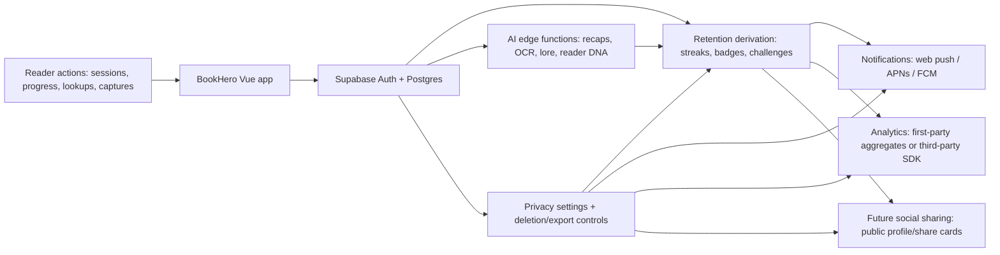

# Research: Security and Compliance for Retention Features

**Agent:** security-and-compliance
**Objective:** What privacy, security, or compliance risks arise from retention/gamification features in BookHero?

## Findings

### 1. Reading behavior becomes sensitive behavioral profile data

- **Data category:** Book titles, reading status, session timestamps, streaks, pauses, completion velocity, favorite genres, abandoned books, vocabulary lookups, recap requests, generated "reader DNA", badges, quests, and retention analytics.
- **Risk:** Even without email marketing or payments, retention features convert ordinary library/progress data into an inferred habit, interest, and personality profile. Books can imply religion, politics, health, sexuality, trauma recovery, age, language, school status, or identity.
- **Compliance impact:** Apple App Privacy labels require disclosure of data collected by the app or third-party partners, including data used only for app functionality. If linked to account/device identity, usage data and user content should be treated as linked to the user. Google Play Data safety similarly requires declaring collected/shared user data and security practices.
- **Mitigation:** Treat retention/gamification state as personal data. Store only the minimum derived metrics needed: e.g. current streak count, last eligible session date, badge IDs, aggregate weekly session count. Avoid storing detailed per-minute behavior unless needed for visible user value.
- **Implementation implication:** Prefer deterministic client/server derivation from existing `reading_progress` and `progress_history` over new long-lived telemetry tables. If new tables are needed, add `user_id`, RLS, retention/deletion behavior, and purpose-specific columns instead of a generic `events jsonb` bucket.

### 2. Streaks and challenges can become manipulative retention design

- **Data category:** Streak counters, missed-session nudges, reminders, badges, leaderboards, "at risk of losing streak" prompts, completion pressure.
- **Risk:** Gamification can cross into dark-pattern territory if it hides choices, makes opt-out difficult, uses guilt/fear wording, preselects privacy-invasive settings, or steers users toward more tracking. FTC guidance calls out designs that trick people into sharing more personal information than intended.
- **Compliance impact:** US consumer protection risk is practical even before formal privacy-law thresholds. App store review risk increases if notification prompts or onboarding are coercive.
- **Mitigation:** Make retention features user-benefiting, reversible, and explainable. No prechecked social sharing. No "keep my data" pressure on delete/export flows. No punishment language for missed days. Let users pause streaks or set low-pressure goals.
- **Implementation implication:** Add a clear settings surface for streaks, challenges, reminders, and analytics participation. Model defaults as conservative booleans, e.g. `notifications_enabled=false`, `social_visibility='private'`, `analytics_opt_in=false` where feasible.

### 3. Notifications require permission, context, and payload minimization

- **Data category:** Push subscription endpoint/token, device/browser identifiers, notification preferences, reminder schedule, last activity date, notification interaction events.
- **Risk:** Web push and mobile push identifiers are persistent enough to identify a device/account. Notification content can leak reading habits on lock screens or shared devices. Over-notification can trigger user complaints, permission denial, and platform review issues.
- **Platform rules:** Web Notifications require secure context and user permission. Android 13+ requires runtime `POST_NOTIFICATIONS` permission for non-exempt notifications. Apple requires authorization for alerts/sounds/badges and recommends asking in context; provisional iOS notifications can be noninterrupting but still need careful preference handling.
- **Mitigation:** Ask after demonstrated intent, e.g. user enables a reading reminder, not at first launch. Store notification payload templates server-side without book-sensitive content by default. Default messages should be generic: "Time for your reading session" instead of "Continue reading [sensitive title]".
- **Implementation implication:** Store push tokens in a dedicated table with `user_id`, platform, token hash/endpoint, scopes, created/last_seen, revoked_at. RLS: user can read/delete own tokens; writes should validate ownership. Edge functions sending pushes must use service role only server-side, never in Vue.

### 4. Future social sharing changes the threat model

- **Data category:** Public profile slug, display name, avatar, reading streak, badges, current books, completed books, recaps, quotes, book passports, generated summaries/images.
- **Risk:** Private reading history may become public by accident through permissive defaults, URL guessing, cached previews, screenshots, or share-card metadata. AI-generated artifacts may reveal page captures or private notes. Social proof features can pressure users to disclose more.
- **Mitigation:** Privacy-by-default. Granular visibility per field: profile, current reading, completed books, streaks, badges, recaps, vocabulary, passport, AI artifacts. Require explicit preview-before-share for every public card.
- **Implementation implication:** Do not infer public visibility from "has profile". Use a `profile_visibility` object or normalized privacy settings table. Avoid public Supabase Storage buckets for generated artifacts unless object paths are unguessable and rows gate access. For public share pages, use server/RPC projections that expose only whitelisted fields.

### 5. Analytics can create third-party disclosure and consent debt

- **Data category:** App events, session frequency, engagement cohorts, device data, coarse location, user properties, custom event parameters, notification opens.
- **Risk:** Analytics SDKs often collect device identifiers, coarse location, app instance IDs, and event metadata. Custom events can accidentally include book titles, notes, search terms, OCR text, or AI prompts. Third-party analytics changes App Store/Google Play disclosures and may trigger consent obligations in EU/UK.
- **Official constraints:** Google Analytics 4 states it does not log or store individual IP addresses, but it still derives coarse geolocation and offers controls for granular location/device data by region. Firebase notes customers are usually controllers/businesses and Google is generally processor/service provider for Firebase data; Google Analytics is a separate service with separate terms.
- **Mitigation:** For prototype, prefer first-party aggregate analytics in Supabase: daily active users, sessions per week, challenge completion counts. If using GA4/Firebase later, define a denylist: no book titles, ISBNs tied to user, OCR text, recap text, vocabulary terms, notes, prompt/response content, or profile slugs in analytics events.
- **Implementation implication:** Create a typed analytics wrapper with allowed event names and parameter schemas. Never call analytics SDKs directly from components. Add a privacy setting and region-aware consent gate before third-party analytics if launched beyond internal testing.

### 6. AI workflows amplify data leakage and retention risk

- **Data category:** Page capture OCR, recap fragments, recaps, recap images, vocabulary extractions, lore cards, reading DNA, prompts, model responses, uploaded images/text.
- **Risk:** Retention features may reuse AI artifacts for badges, challenges, or share cards. That can expose copyrighted text snippets, sensitive user notes, OCR from private surroundings, or model hallucinations presented as personal insights. AI vendor logs may retain prompt/response content for abuse monitoring or optional logging.
- **Official constraints:** OpenAI API data is not used to train models by default unless opted in, but abuse monitoring logs may contain prompts/responses and are retained up to 30 days by default. Gemini API docs state billing-enabled API logs expire after 55 days by default when logging is enabled and are not used for product improvement by default; shared datasets/feedback may be reviewed and used for model improvement.
- **Mitigation:** Keep AI-derived retention metadata separate from raw AI inputs. Do not feed personal streak/social data into prompts unless needed. Strip user IDs, exact timestamps, and unrelated profile metadata before model calls. Disable optional AI log sharing for production projects. Do not store page images unless the user explicitly saves them.
- **Implementation implication:** Edge functions should use least-privilege env secrets, redact logs, and record AI provenance: provider, model, generated_at, source book/progress IDs, not raw prompt unless there is a clear debugging retention policy.

### 7. Supabase RLS is the main security boundary

- **Data category:** All gamification tables, privacy settings, push subscriptions, analytics aggregates, public profile projections.
- **Risk:** Vue clients run in an untrusted browser. Any table in the exposed `public` schema without RLS/policies can leak or allow modification. Views can bypass RLS by default if created as `security definer`. Service role key exposure would bypass RLS entirely.
- **Official constraints:** Supabase says RLS should always be enabled on exposed-schema tables/views/functions, anon key is safe only with RLS, and service role keys must never be exposed in the browser.
- **Mitigation:** Enable RLS on every retention table. Policies should explicitly use `to authenticated` and `auth.uid() is not null and auth.uid() = user_id`. Use `with check` on inserts/updates. Keep public profile views as `security_invoker=true` where supported or move read projections behind controlled RPC/edge functions.
- **Implementation implication:** Add migration checklist: RLS enabled, select/insert/update/delete policies, indexes on `user_id`, policy tests, no service keys in frontend bundle, no broad `anon select` on source tables.

### 8. Abuse and integrity risks affect fairness and trust

- **Data category:** Streak events, challenge completions, badge grants, leaderboard scores, session history writes.
- **Risk:** If badges/challenges are derived from client-submitted events, users can forge progress from devtools. Future social/leaderboards invite score tampering. Retention experiments can be polluted by fake sessions.
- **Mitigation:** Treat client events as requests, not truth. Server should derive eligibility from durable progress/session history. Add idempotency keys and uniqueness constraints for badge grants. Rate-limit write-heavy endpoints.
- **Implementation implication:** Use Postgres constraints like unique `(user_id, badge_id)` or `(user_id, challenge_id, period_start)`. Use RPC/edge functions for badge awards that validate source progress rows. Keep "session" definitions explicit to avoid users accidentally creating streaks through imports or completed-book setup flows.

### 9. Deletion, export, and reset need product-level semantics

- **Data category:** Streaks, badges, quests, notification tokens, analytics events, AI artifacts, public shares.
- **Risk:** Users may delete a book or reset progress but derived gamification records continue to reveal the prior reading. Public share URLs and cached Open Graph images may outlive privacy changes. AI/vendor logs may persist after local deletion.
- **Mitigation:** Define cascading behavior. Deleting progress should delete or anonymize related retention state unless the user chooses to keep aggregate achievements. Revoking public profile should immediately disable public projections and share pages.
- **Implementation implication:** Add data map and deletion jobs for every retention table. Use soft delete only if needed for abuse/integrity, with clear retention windows. Store notification tokens separately so account deletion/revocation can purge them without scanning analytics.

### 10. Children and teen readers are a boundary to decide early

- **Data category:** Persistent identifiers, reading behavior, public profile content, notification tokens, photos/page captures, generated artifacts.
- **Risk:** BookHero targets normal readers, but reading apps can attract minors. If the app is directed to children under 13 or has actual knowledge it collects data from children under 13, COPPA obligations apply. Persistent identifiers, photos, and usernames can be personal information under COPPA.
- **Mitigation:** For prototype, state general-audience positioning and avoid child-directed copy, school classroom workflows, or under-13 onboarding. If minors become a target segment, design age screening and parental consent before collecting personal data.
- **Implementation implication:** Do not launch social sharing, public profiles, or behavioral analytics for known under-13 users without a COPPA design. Avoid collecting birthdate unless needed; if used for age gate, collect before other personal data and store minimally.

## Diagram (if applicable)

## Implications for This Context

- **Default design:** Private by default. Retention features should work as personal progress tools before any social layer exists.
- **Data model:** Add small purpose-built tables only if existing `reading_progress` and `progress_history` cannot derive the feature. Avoid a generic behavioral event firehose.
- **RLS:** Every table storing retention, notification, privacy, public-profile, or analytics preference data needs RLS before frontend access. Public share data should be served from whitelisted projections, not source tables.
- **Notifications:** Build opt-in settings first. Ask permission only after the user configures a reminder. Store generic message templates and avoid book titles in lock-screen payloads by default.
- **Analytics:** Use first-party Supabase aggregates for the success metric "more sessions per week." If adding GA4/Firebase, gate third-party analytics behind a typed wrapper and privacy controls.
- **AI:** Retention should reference AI artifacts by ID and summary metadata, not copy raw prompt/OCR/recap text into gamification or analytics tables.
- **Social future-proofing:** Model visibility as field-level settings now, even if UI launches later. This avoids painful migrations from all-private to mixed public/private profiles.
- **Mobile readiness:** Maintain an internal data inventory aligned to Apple App Privacy and Google Play Data safety categories. Update it whenever a new SDK, notification provider, analytics provider, or AI provider is added.
- **Operational checklist before implementation:** RLS policy tests, secrets scan, vendor data-use review, privacy settings UI, delete/export semantics, analytics denylist, notification payload review, and no public buckets for sensitive generated artifacts.

## References and Sources

- Apple Developer, "App privacy details on the App Store": https://developer.apple.com/app-store/app-privacy-details/
- Google Play Help, "Provide information for Google Play's Data safety section": https://support.google.com/googleplay/android-developer/answer/10787469
- MDN Web Docs, "Notifications API": https://developer.mozilla.org/en-US/docs/Web/API/Notifications_API
- MDN Web Docs, "Notification.requestPermission()": https://developer.mozilla.org/en-US/docs/Web/API/Notification/requestPermission_static
- Apple Developer Documentation, "Asking permission to use notifications": https://developer.apple.com/documentation/UserNotifications/asking-permission-to-use-notifications
- Apple Developer Documentation, `UNAuthorizationOptions.provisional`: https://developer.apple.com/documentation/usernotifications/unauthorizationoptions/provisional
- Android Developers, "Notification runtime permission": https://developer.android.com/develop/ui/views/notifications/notification-permission
- Supabase Docs, "Row Level Security": https://supabase.com/docs/guides/database/postgres/row-level-security
- Supabase Docs, "Securing your data": https://supabase.com/docs/guides/database/secure-data
- Supabase Docs, "Securing your API": https://supabase.com/docs/guides/api/securing-your-api
- Google Analytics Help, "[GA4] EU-focused data and privacy": https://support.google.com/analytics/answer/12017362
- Firebase, "Privacy and Security in Firebase": https://firebase.google.com/support/privacy/
- Firebase, "Storing privacy settings with Firebase": https://firebase.google.com/support/privacy/storing-privacy-settings
- OpenAI Platform Docs, "Data controls in the OpenAI platform": https://platform.openai.com/docs/guides/your-data/
- Google AI for Developers, "Gemini API Data Logging and Sharing": https://ai.google.dev/gemini-api/docs/logs-policy
- Google AI for Developers, "Gemini API Additional usage policies": https://ai.google.dev/gemini-api/docs/usage-policies
- FTC, "FTC Report Shows Rise in Sophisticated Dark Patterns Designed to Trick and Trap Consumers": https://www.ftc.gov/news-events/news/press-releases/2022/09/ftc-report-shows-rise-sophisticated-dark-patterns-designed-trick-trap-consumers
- FTC, "Complying with COPPA: Frequently Asked Questions": https://www.ftc.gov/business-guidance/resources/complying-coppa-frequently-asked-questions
