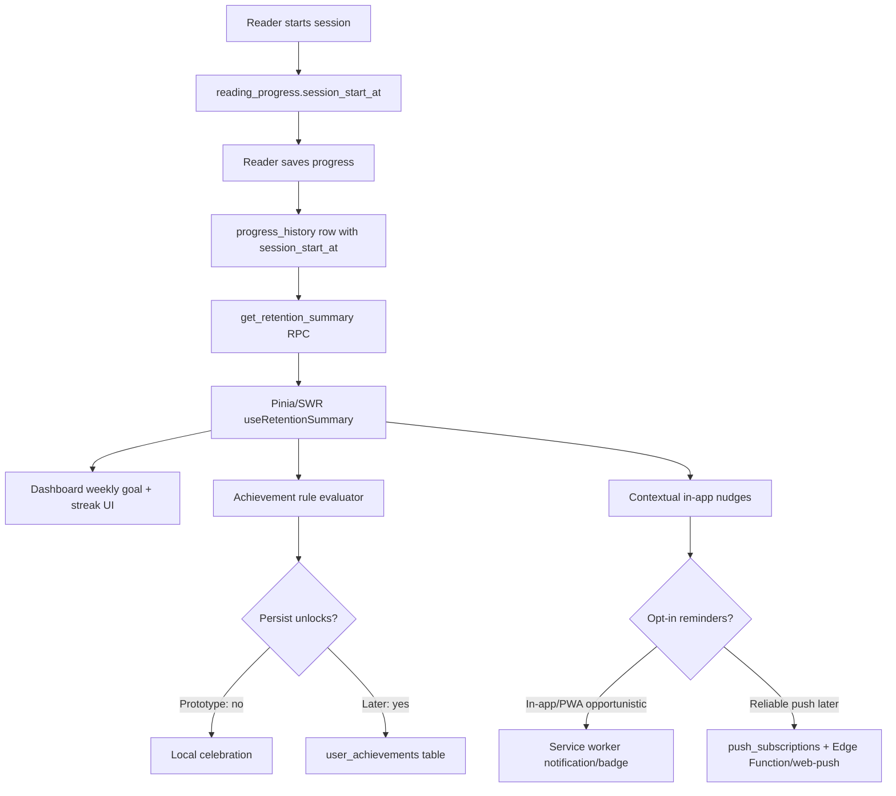

# Research: Technical Approaches for Retention Mechanics

**Agent:** technical-approaches
**Objective:** What technical approaches can implement weekly-session retention/gamification in this Vue/Supabase prototype, with future mobile portability?

## Findings

- Best prototype anchor: existing `progress_history` + `session_start_at` ledger. Current code already records explicit session starts on `reading_progress.session_start_at`, writes ended sessions into `progress_history.session_start_at`, and clears active session state after a progress save. Weekly-session retention can derive most v1 mechanics from this without new storage.

- Streaks should be derived first, persisted later only if needed. Current `get_reading_stats` RPC already computes day streaks from distinct `date(recorded_at)` and exposes `currentStreakDays`/`longestStreakDays`. For retention feature, add a new RPC or extend stats with weekly session fields: `sessionsThisWeek`, `weeklyGoal`, `weeklyGoalMet`, `activeDaysThisWeek`, `lastSessionAt`, `nextSuggestedSessionAt`. Keep the rule deterministic and server-derived so Vue, future iOS, and future Android see identical state.

- Weekly goals need user preference storage. A prototype can default to 3 sessions/week in code, but a real weekly-goal mechanic needs a small `retention_preferences` table keyed by `user_id`: `weekly_session_goal int`, `reminder_enabled bool`, `reminder_days int[]`, `reminder_time_local time`, `timezone text`, `quiet_hours jsonb`, `updated_at timestamptz`. Avoid embedding goals in `profiles` unless this repo already has a stable profile table; retention settings change more often than identity fields.

- Achievement rules are cheapest as pure functions over aggregate snapshots. Define rule IDs in TypeScript (`first_session`, `three_sessions_week`, `two_week_streak`, `comeback_after_7_days`, `finish_after_streak`) and evaluate against the RPC result plus latest session event. This supports fast prototyping and avoids table churn. Add `user_achievements` only when the app must preserve unlock timestamps, prevent repeat celebration, or sync badge history across devices.

- Achievement evaluation has two viable paths:
  - Client-side rules: simplest. Run after `progressStore.updateProgress` succeeds and after reading-stats RPC revalidates. Store seen/unlocked IDs in Supabase only when needed. Risk: duplicated logic if mobile apps later implement native clients.
  - Database or Edge Function rules: more portable. Insert progress, derive aggregate, return newly unlocked achievement IDs from an RPC or Edge Function. Risk: more upfront schema/testing; harder to iterate on copy and tuning.

- Nudges should start as contextual UI, not push notifications. Examples: dashboard "2 of 3 sessions this week", book-card "one short session keeps the week alive", post-session "one more session hits your weekly goal". These require no permissions, work on every browser, and avoid notification fatigue. Push/local reminders should be opt-in and come after the in-app nudge loop proves useful.

- PWA local reminders are limited in browsers. `ServiceWorkerRegistration.showNotification()` can display a persistent notification from an active service worker after permission is granted, but the web platform has no broadly reliable "local notification at 7 PM tomorrow" primitive across browsers. A page can schedule with `setTimeout` only while open; service workers can respond to events but are not guaranteed to wake at arbitrary local times. Treat browser local reminders as opportunistic: show "start reading" reminder while app is open/installed, use app badge where supported, and degrade cleanly.

- Web Push is the reliable web reminder path, but it adds backend and consent complexity. Browser Push API lets a service worker receive server-pushed messages when the app is not loaded, but it needs push subscriptions, VAPID/web-push infrastructure, unsubscribe handling, permission UX, and CSRF-safe subscription endpoints. Supabase Edge Functions can store/manage subscriptions and trigger sends, but Supabase alone does not provide a built-in scheduler in this repo. Prototype can defer this.

- Current service worker is already a good extension point. `src/sw.ts` uses `vite-plugin-pwa` injectManifest, Workbox precaching/runtime caching, and Background Sync for progress queue flushing. Add notification click handling and optional badge updates there later. Do not put Supabase auth writes directly in the service worker unless the project explicitly designs token handoff; current code already avoids Supabase calls in SW context because auth token is unavailable.

- Server-side aggregates fit the repo's recent direction. The project already moved profile/library stats into SQL RPCs to avoid full-history client scans. Retention should follow same pattern: one `get_retention_summary(p_user_id uuid)` RPC returning compact JSON. Suggested fields: `weekStart`, `weekEnd`, `sessionsThisWeek`, `weeklyGoal`, `goalProgressPct`, `activeDaysThisWeek`, `currentStreakDays`, `longestStreakDays`, `lastSessionAt`, `daysSinceLastSession`, `eligibleAchievements`, `nudgeCode`.

- Session definition must be explicit. Current stats count some values from all `progress_history` rows and separately identify `valid_sessions` as `session_start_at is not null`, duration >= 60 seconds, and page delta >= 1. Weekly-session gamification should probably count explicit completed sessions, not every legacy page save, to avoid rewarding imports or accidental progress changes. For average/inconsistent readers, allow a 0-page explicit session to count only if product intentionally wants "showing up" over pages read.

- Timezone handling matters for weekly goals. PostgreSQL `date(recorded_at)` uses database/session timezone unless specified. For "sessions this week", use the user's configured timezone or browser timezone stored in preferences, then compute local week boundaries. Prototype shortcut: use client to pass `p_timezone text` and `p_week_start int` into RPC. More robust: persist timezone on preference update.

- Analytics events should be append-only and low cardinality. A prototype table `analytics_events` can record `user_id`, `event_name`, `source`, `book_id`, `properties jsonb`, `created_at`. Events: `retention_card_viewed`, `weekly_goal_set`, `weekly_goal_completed`, `achievement_unlocked`, `nudge_shown`, `nudge_clicked`, `reminder_permission_prompted`, `reminder_permission_result`, `session_started`, `session_completed`. Keep payloads small; avoid page text, notes, OCR, or book content.

- Analytics can also be derived from existing writes. For core metric "sessions per week", the primary source should remain `progress_history`, not clickstream. Events measure funnel behavior and nudge effectiveness, not the truth of reading activity. This prevents event loss/adblock/offline gaps from corrupting success metrics.

- Offline behavior should reward confirmed data only. Existing start-session flow blocks offline because session start must be server-confirmed, while progress updates can queue offline. Retention mechanics should not unlock achievements from queued writes until sync succeeds and RPCs revalidate. UI can show pending state, but durable badges and weekly counts should come from server-confirmed history.

- Future mobile portability favors domain services over Vue-only composables. Keep retention rule definitions as plain TypeScript modules with no Vue imports: `src/domain/retention/rules.ts`, `src/domain/retention/types.ts`, `src/composables/useRetentionSummary.ts`. If native apps later use Swift/Kotlin with Supabase RPCs, the server summary and rule IDs remain stable even if UI implementation changes.

- Schema options by prototype stage:
  - Stage 1: no migrations. Extend existing stats RPC or add one read-only RPC. Default weekly goal in frontend. In-app cards only.
  - Stage 2: add `retention_preferences` and `user_achievements`. Persist goal/reminder settings and unlocked achievement history.
  - Stage 3: add `push_subscriptions` and optional `analytics_events`. Edge Function or external scheduled worker sends opt-in reminders.

- Use Pinia/SWR pattern already in repo. Add `cacheKeys.retentionSummary(userId)`, a 30-120 second TTL, and invalidation from `progressStore.updateProgress` after successful history insert/session end. This matches `useReadingProfile`, `useLastSession`, and `useReadingVelocity` patterns and keeps dashboards responsive.

- Avoid triggers for prototype achievement writes. PostgreSQL triggers hide behavior from the Vue flow and make copy/rule iteration slower. Prefer explicit RPC or client-triggered insert after a session ends. Use unique constraint `(user_id, achievement_id)` for idempotence if `user_achievements` is added.

- Recommended prototype implementation:
  1. Add `get_retention_summary(p_user_id uuid, p_timezone text default 'UTC')` RPC using `progress_history` and optional default goal 3.
  2. Add `useRetentionSummary.ts` composable with SWR cache and invalidation on session end.
  3. Add pure TS `evaluateAchievements(summary, previousAchievements)` for local celebration.
  4. Add Dashboard/Book Detail in-app weekly-goal surfaces.
  5. Instrument lightweight events only around nudge impressions/clicks and weekly goal completion if analytics table exists or is approved.

## Diagram (if applicable)

## Implications for This Context

- Build on existing session infrastructure. No new "sessions" table needed for prototype because `progress_history` already functions as the completed-session ledger.

- Add one narrow RPC before adding tables. `get_retention_summary` keeps weekly counts, streaks, goal progress, and nudge eligibility consistent across Vue now and mobile later.

- Keep the first release permissionless. In-app goal/streak/achievement UI can test whether retention mechanics move sessions/week before asking for notification permissions or adding push infrastructure.

- Add preference persistence when the weekly goal becomes editable. A hardcoded 3 sessions/week is acceptable for prototype research, but users will expect control once goals are visible.

- Treat reminders as a later layer. Browser notifications are permissioned and uneven for scheduled local use; reliable reminders require Push subscriptions plus a server-side send path. For later native iOS/Android, map the same retention preference model to native local notifications.

- Use analytics to evaluate nudges, not to compute the success metric. Weekly sessions should be computed from confirmed progress/session records. Analytics events answer which surfaces caused a session start.

- Explicitly define week and session semantics in the spec. Ambiguity around local timezone, legacy page saves, 0-page sessions, and queued offline writes will otherwise create confusing streak/goal behavior.

## References and Sources

- Supabase JavaScript RPC documentation: `supabase.rpc()` calls Postgres functions from the client, including function arguments and filters. https://supabase.com/docs/reference/javascript/rpc
- Supabase Edge Functions documentation: Deno-compatible TypeScript functions for server-side logic, auth-aware HTTP endpoints, integrations, and short-lived operations. https://supabase.com/docs/guides/functions
- MDN Notifications API: persistent notifications are created from service workers and can outlive a page. https://developer.mozilla.org/en-US/docs/Web/API/Notifications_API
- MDN `ServiceWorkerRegistration.showNotification()`: displays a notification from an active service worker in secure contexts, after permission. https://developer.mozilla.org/en-US/docs/Web/API/ServiceWorkerRegistration/showNotification
- MDN Push API: lets web apps receive server-pushed messages through service workers when the app is not foregrounded or loaded; subscription endpoints require protection. https://developer.mozilla.org/en-US/docs/Web/API/Push_API
- MDN Badging API: app/document badges are available only in some browsers, so use as progressive enhancement. https://developer.mozilla.org/en-US/docs/Web/API/Badging_API
- Local repo: `src/composables/useReadingSession.ts`, `src/stores/progress.ts`, `src/composables/useReadingProfile.ts`, `src/sw.ts`, `vite.config.ts`, `supabase/migrations/20260424_session_stats.sql`, `supabase/migrations/20260502_rpc_performance_improvements.sql`.
