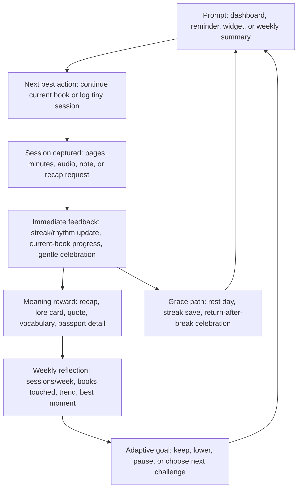

# Research: UX Patterns for Reading Consistency

**Agent:** ux-patterns
**Objective:** What UX patterns and interface conventions motivate consistency for reading without creating guilt or homework?

## Findings

- Users already expect a daily/weekly consistency surface, not just a finished-books counter. Apple Fitness centers the Summary screen on daily rings, trends, awards, and workout history; Strava puts goals, challenge progress, and Year in Sport under the Progress tab; StoryGraph exposes yearly challenges, January Pages, stats, reading journal, and Up Next queue. Reading consistency UI should therefore show "read today / this week" beside "books finished."

- Streaks work best when the required action is tiny and clear. Duolingo defines streak maintenance as completing one lesson, even for a few minutes. StoryGraph's January Pages Challenge sets an even smaller reading action: one page or one audiobook minute per day. BookHero should avoid "read a chapter" as the default daily target; use a minimum viable session such as "log any reading," "read 5 minutes," "read 1 page," or "listen 1 minute."

- Forgiving streak mechanics are now expected in habit apps. Duolingo's Streak Freeze protects a streak when users miss a day and is explicitly framed as flexibility, not cheating. This matters for reading because many users already carry guilt around inconsistency. BookHero can use "grace days," "rest days," or "bookmark saves" that preserve identity as a reader while making the missed day visible but non-catastrophic.

- Progress indicators should exploit goal proximity without overfitting to book completion. Apple uses rings for same-day progress, Strava uses progress bars for goals/challenges, and Goodreads uses annual reading challenge progress. For reading, use multiple scales: today/session, week, current book, and yearly curiosity. Avoid one giant annual "behind schedule" meter as the dominant object; it can make reading feel like a debt.

- Weekly goals should be session-based before volume-based. The north-star is more reading sessions per week, and Strava supports activity-count goals alongside distance/time/elevation. A reading app equivalent is "3 reading days this week" or "4 sessions this week," with optional page/minute goals secondary. This helps slow books, audiobooks, re-reads, and abandoned books still count.

- Ritual design should turn the next action into a low-friction prompt. Fogg Behavior Model: behavior happens when motivation, ability, and prompt converge. For BookHero, the strongest prompt is contextual and concrete: "Continue The Fifth Season, page 142," "2 minutes keeps this week's rhythm," or "Capture one line before bed." Dashboard CTA should always resolve to a single next-best action, not a menu of gamification features.

- Celebrations should be immediate, brief, and specific to what the reader did. Duolingo reports that a streak-extension animation increased 7-day retention for new learners by 1.7%. Apple awards personal records, streaks, major milestones, and monthly challenge awards. BookHero celebrations should name the achievement: "Third session this week," "First morning read," "100 pages with this book," "Returned after 9 days." Keep animation/light effects tasteful and skippable.

- Milestone variety prevents streaks from becoming stale. Duolingo distinguishes early streak growth from long streak maintenance and adds milestone-day animations. BookHero can rotate milestone types: first 3-session week, first month with any reading every week, longest return-after-break, first completed recap, first finished book after DNF, first audiobook session.

- Recap rewards can be intrinsic, not loot-box-like. BookHero already has recap/lore/passport concepts; gamification can reward reading sessions with meaning unlocked from the book: session insight, spoiler-safe recap, lore card, vocabulary find, "what changed since last time" note. This makes the reward deepen the reading, rather than turning reading into currency grinding.

- Weekly summaries are expected as personal storytelling. Strava Year in Sport is a personalized recap with scenes, shareable images, and meaningful social moments; StoryGraph emphasizes charts for pages/books per month, mood, pace, and ratings. BookHero should generate weekly "Reading Pulse" cards: sessions, days read, pages/minutes, best streak, books touched, one quote/note, recap unlocked, and "next week, keep it easy" CTA.

- Social motivation should be opt-in, small-group, and privacy-aware. Apple Activity sharing lets friends see daily stats, get notifications, mute notifications, hide activity, remove friends, and run 7-day competitions. Strava Challenges can be public leaderboard or private progress. Reading is more intimate than exercise; default to private progress, then allow buddy streaks, club challenges, or family rooms where only selected signals are visible.

- Challenges should support prompt-, book-, number-, and habit-based formats. StoryGraph added Book challenges and Number challenges beyond prompt-based reading challenges. This maps cleanly to BookHero: "Read 3 nights this week" (habit), "Finish one owned book" (number/criteria), "Read a chapter from your Up Next" (book), "Read outside your usual mood" (prompt).

- Challenges should be discoverable but not mandatory. StoryGraph has a challenge directory with categories such as genres, TBR, geographical, book clubs, awards, languages, and numerical. BookHero can surface a few "quiet challenges" in a dedicated tab or card, not interrupt core reading flow. Users struggling with consistency need fewer obligations on the dashboard, not more.

- Apple Fitness-style trends suggest a better alternative to shame. Apple compares recent averages to longer-term averages and gives coaching such as a small extra daily action when a trend declines. BookHero can compare the last 4 weeks to the prior 12 weeks and frame changes gently: "Your rhythm dipped; one 5-minute session today gets the week moving." Avoid "you are behind."

- Users expect editable goals. Strava allows goal metric/timeframe selection and customization of suggested goals. Apple lets users adjust Activity ring goals. Goodreads repeatedly advises setting small, realistic goals and increasing them later. BookHero should make goals adjustable from the progress surface, including "pause goal," "lower goal," "switch from pages to sessions," and "vacation mode."

- "Behind schedule" should be replaced with "next recoverable step." Goodreads' annual challenge model creates a familiar progress expectation, but reading discourse now criticizes target-chasing for making reading feel metric-driven. The UI pattern should be recovery-first: show the smallest step that restores momentum this week, not a red deficit for the year.

- Identity badges should reflect reader identity, not productivity only. Fitness apps award streaks and personal records; reading apps can celebrate tastes and rituals: "Sunday Reader," "Lunch Break Reader," "Slow Burn Finisher," "Audiobook Commuter," "Genre Explorer," "Returned to a tough book." These badges reinforce belonging and self-concept without implying that faster reading is better.

- Recency matters more than lifetime totals for reactivation. Strava Progress and Apple Summary center current state; Duolingo pushes today's lesson/streak. BookHero dashboard should prioritize: current book, today's possible session, weekly rhythm, recent win, next reward. Lifetime totals can live in Profile/Library.

- Completion should never be the only celebrated outcome. StoryGraph and Goodreads support DNF/abandoned reading contexts; StoryGraph's broader stats and challenges let curiosity count. BookHero should count pages/minutes/sessions from books not finished, and celebrate "decided this is not for me" when a user marks DNF with a note. This protects exploratory reading.

- Share cards should be optional artifacts, not default broadcasting. Strava Year in Sport lets users share individual images and a summary image; Apple awards are inspectable and shareable via system flows. For BookHero, weekly recap cards and milestone cards can be shareable, but private by default. Good share content: "4 sessions this week," current cover, favorite mood, no exact page count unless user chooses.

- Best next action should be one tap and tied to existing context. Effective conventions: "Continue" button, progress ring/bar, tiny session goal, reward preview, and "log session" fallback. For average readers, dashboard should avoid asking them to choose between stats, challenges, recaps, lore, goals, and profile before they read. Primary CTA: "Read now" or "Log progress"; secondary CTA: "Get recap" only when useful.

## Diagram (if applicable)

## Implications for This Context

- Make the core metric "reading sessions per week." Pages/minutes/books remain visible, but the dashboard should optimize for "start/record a session today" and "build a weekly rhythm."

- Use "rhythm" language over "discipline" language. Labels: Weekly Rhythm, Reading Pulse, Grace Day, Tiny Session, Return Win. Avoid homework-coded labels: assignments, overdue, failed, catch up, penalties.

- Prototype dashboard module order:
  1. Current book CTA: Continue / Log progress.
  2. Weekly rhythm strip: 7-day row, sessions completed, next tiny action.
  3. Reward preview: next recap/lore/passport unlock.
  4. Gentle goal card: editable session goal, grace state, trend coaching.
  5. Optional challenge/social entry point.

- Streak design should support misses:
  - "Reading rhythm" counts sessions in a rolling week.
  - "Daily streak" optional, off by default or introduced after early success.
  - One or two monthly grace days.
  - "Return streak" celebration after inactivity.
  - No destructive zero-state that erases user identity.

- Challenges should be lightweight and bookish:
  - "Read 1 page/day for 7 days."
  - "Three 10-minute sessions this week."
  - "Read from your Up Next queue twice."
  - "Unlock one recap by Sunday."
  - "Read one owned book."
  - "Buddy read: both log one session this week."

- Recap rewards are a strategic differentiator. Apple and Strava reward activity with progress/status; BookHero can reward activity with comprehension and momentum. A good loop: read -> log -> recap/lore unlock -> confidence to resume -> more sessions.

- Weekly summary should be restorative. When the week is light, show "You read once; that still counts" plus one next action. When strong, show "4 sessions, 2 books touched, 86 pages, longest rhythm yet." Always end with a low-friction CTA.

- Default privacy should be private. Add sharing later as explicit "share this card" or "invite buddy" actions. Reading notes, recaps, and book choices can reveal sensitive interests; avoid automatic feed posts.

- Interface conventions users already understand:
  - 7-day strip or calendar heat row for rhythm.
  - Progress bar for weekly/session goals.
  - Badge/trophy shelf for milestones.
  - Shareable recap card.
  - Suggested goal with Customize action.
  - Challenge detail page with join button, rules, progress, completion badge.
  - Friend/buddy challenge with opt-in invite and mute/hide controls.

## References and Sources

- Apple Support, "Track daily activity with Apple Watch" - Activity rings, Trends, awards, streaks, milestones, reminders, Daily Coaching. https://support.apple.com/en-us/HT204517
- Apple Human Interface Guidelines, "Activity rings" - users expect progress rings only when relevant; rings represent daily progress toward specific goals. https://developer.apple.com/design/human-interface-guidelines/activity-rings
- Apple Support, "Share your activity from Apple Watch" - friend sharing, notifications, mute/hide controls, 7-day competitions, percentage-based scoring. https://support.apple.com/en-mt/guide/watch/apd68a69f5c7/watchos
- Strava Support, "Goals on the Strava App" - weekly/monthly/yearly goals across distance, time, activity count, elevation; suggested goals and customization. https://support.strava.com/hc/en-us/articles/6822535085709-Goals-on-the-Strava-App
- Strava Support, "Strava Challenges" - challenge gallery, join flow, public/private progress, progress bars, leaderboard rules, trophy case. https://support.strava.com/hc/en-us/articles/216919177-Strava-Challenges
- Strava Support, "Your Year in Sport" - personalized recap, in-app scenes, shareable images, monthly stat cards, streak cards. https://support.strava.com/hc/articles/22067973274509
- The StoryGraph homepage - stats charts, reading challenges, reading journal, Up Next queue, buddy reads, recommendations. https://www.thestorygraph.com/
- The StoryGraph Reading Challenges directory - challenge discovery, categories, participant counts, create/join conventions. https://app.thestorygraph.com/reading_challenges
- The StoryGraph, "January Pages Challenge 2026" - habit challenge requiring at least one page or one audiobook minute per day. https://app.thestorygraph.com/january_pages_challenges/444c4bab-afa7-42bb-bb0d-ae2f66f50dc4
- The StoryGraph changelog, "New Reading Challenge Styles" - prompt, book, and number challenge formats. https://roadmap.thestorygraph.com/changelog/new-reading-challenge-styles
- Goodreads Blog, "Want to Read More This Year? Join the 2017 Reading Challenge" - annual goal, progress tracking, celebrating success, advice to start small. https://www.goodreads.com/blog/show/779-want-to-read-more-this-year-join-the-2017-reading-challenge
- Goodreads Blog, "Tips to Read More Books in 2023 with the Goodreads Reading Challenge!" - make reading easy, plan context, goal-setting advice. https://www.goodreads.com/blog/show/2465-tips-to-read-more-books-in-2023-with-the-goodreads-reading-challenge
- Duolingo Blog, "The Duolingo Streak Uses Habit Research to Keep You Motivated" - streaks as habit mechanic, streak freeze, tiny daily action, 7-day learner impact, animation retention lift. https://blog.duolingo.com/how-duolingo-streak-builds-habit/
- Duolingo Blog, "Friend Streak Is Duolingo's Latest Social Feature" - shared streaks with up to five friends as opt-in commitment. https://blog.duolingo.com/friend-streak/
- Stanford Behavior Design Lab, "Fogg Behavior Model" - behavior requires motivation, ability, and prompt; useful lens for tiny reading prompts. https://behaviordesign.stanford.edu/resources/fogg-behavior-model
- Fogg Behavior Model, "Prompts" - prompts can be external or routine-based and should tell users what to do now. https://www.behaviormodel.org/prompts
- Laws of UX, "Goal-Gradient Effect" - visible progress and proximity to goal increase motivation; useful but should be balanced against reading-pressure risk. https://lawsofux.com/goal-gradient-effect/
