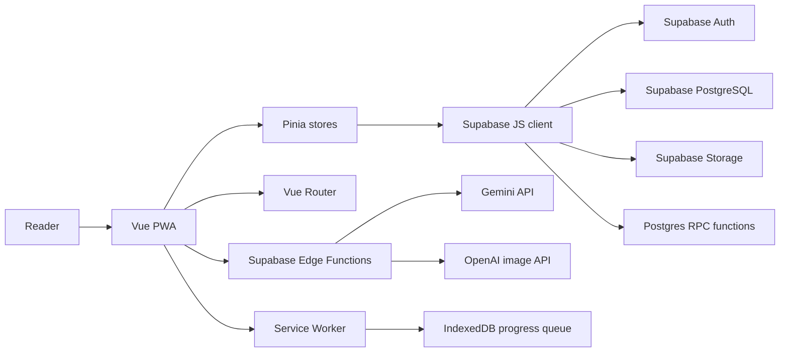
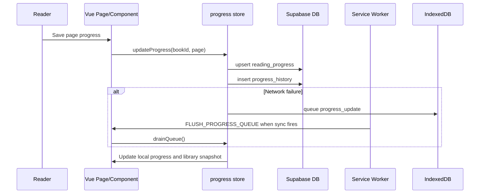
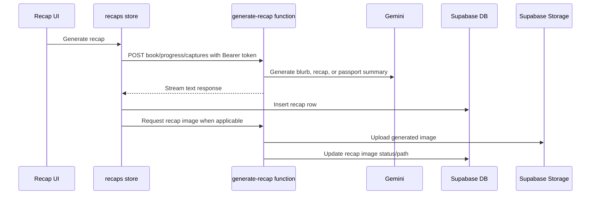

# Architecture

Last updated: 2026-06-18

BookHero is a client-heavy Vue PWA backed by Supabase. The browser app owns routing, UI state, caching, offline progress queueing, and most user workflows. Supabase provides authentication, persistence, storage, database RPCs, and edge functions for AI workflows.

> The patterns below remain accurate. Two areas have grown since this page was first written: a **Community + Reading Circles** layer (RPC-heavy, RLS relationship-gated) and the **Search & Add** book flow (Google Books primary, Open Library gap-fill). Full backend surface: [`docs/backend-contract.md`](../backend-contract.md).

## System Overview

## Frontend Layers

| Layer | Responsibility |
| --- | --- |
| Pages | Route-level composition and workflow screens. |
| Components | Reusable UI within dashboard, book, library, capture, recap, profile, and lexicon areas. |
| Composables | Shared stateful logic such as active book selection, reading session timer, cache, OCR capture, ISBN lookup, and profile stats. |
| Pinia stores | Domain state, Supabase reads/writes, cache invalidation, and cross-feature effects. |
| Services | Thin clients for Supabase and Edge Function HTTP calls. |
| Utils | Pure helpers for milestone detection, completion prompts, dates, cover fallback, and master recap lookup. |

## Data Flow: Reading Progress

## Data Flow: AI Recap

## Key Design Decisions

- Use Supabase Auth session persistence in the browser through `supabase-js`.
- Use RLS-backed tables and user-scoped queries rather than a custom backend server.
- Keep AI provider keys out of the browser by routing AI work through Edge Functions.
- Use Postgres RPCs for aggregate profile, library, velocity, quest, and passport statistics.
- Use a client-side SWR cache primitive for fast re-entry and explicit invalidation.
- Use IndexedDB only for offline progress queueing; most app data remains in Supabase.
- Avoid persisting captured page images; the app persists reviewed OCR text instead.

## External Integrations

| Integration | Purpose |
| --- | --- |
| Supabase Auth | Email/password, magic link, session persistence. |
| Supabase PostgreSQL | Books, progress, recaps, captures, lexicon, lore, profile data, goals. |
| Supabase Storage | Recap images in the `recap-images` bucket. |
| Supabase Edge Functions | AI and OCR workflows. |
| Gemini | Text generation, OCR interpretation, vocabulary/lore/profile generation. |
| OpenAI image generation | Recap image generation. |
| Open Library | ISBN lookup and cover metadata. |
| Google Books | Optional ISBN fallback lookup. |
| Dictionary API | Vocabulary lookup in `useLexicon`. |

