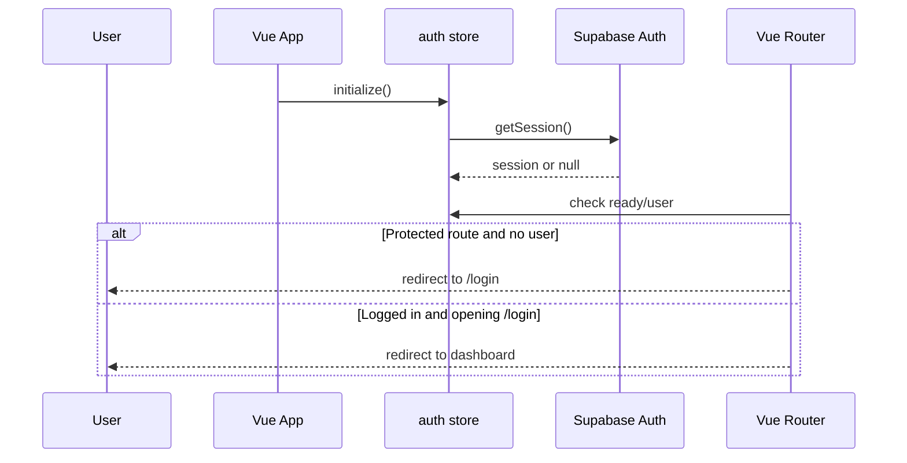

# Authentication Authorization

Last updated: 2026-05-17

BookHero uses Supabase Auth for identity, session management, and access tokens.

## Login Methods

The auth store supports:

- Email/password sign in
- Email/password sign up
- Magic link sign in
- Sign out

Implementation:

- `src/stores/auth.ts`
- `src/pages/AuthPage.vue`
- `src/services/supabase.ts`

## Session Flow

## Protected Routes

All routes under the default layout require authentication:

| Route | Purpose |
| --- | --- |
| `/` | Dashboard |
| `/library` | Library |
| `/books/add` | Add book |
| `/books/:id` | Book detail |
| `/books/:id/recaps` | Recap history |
| `/books/:id/passport` | Book Passport |
| `/lexicon` | Great Library / lexicon |
| `/profile` | Reader profile |
| `/anki-review` | Vocabulary review |

Public routes:

| Route | Purpose |
| --- | --- |
| `/login` | Authentication page |
| `/:pathMatch(.*)*` | Not found page |

## Authorization

Authorization is primarily enforced by Supabase Row-Level Security. Client-side checks improve UX but must not be treated as the security boundary.

Patterns in the codebase:

- Records include `user_id`.
- Stores read/write rows scoped to the authenticated user.
- Edge Functions require a Supabase JWT and validate it before AI work.
- Storage policies for recap images are owner-scoped.

## Security Considerations

- Keep AI provider keys in Supabase Edge Function secrets, never in Vite variables.
- `VITE_*` variables are embedded in the browser bundle and must be safe to expose.
- Verify RLS policies for all base tables before production launch.
- Captured page images are not persisted; reviewed OCR text is persisted.
- The Supabase anon key is public by design, so RLS correctness is critical.

## Roles and Permissions

Custom user roles are not currently documented in the codebase. The app appears to use a single authenticated reader role with owner-scoped access.

