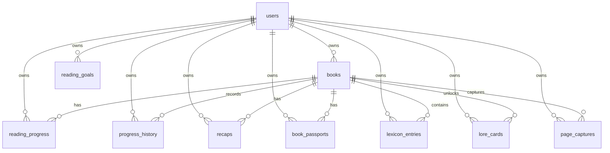

# Database Data Model

Last updated: 2026-06-20

> **Canonical source:** [`docs/backend-contract.md`](../backend-contract.md) is generated from a live introspection of the database and is authoritative. This page is a curated summary of the **core reading** domain and may lag. The live DB has **25 tables** total — this page historically omitted the **Community** (`community_profiles`, `community_profile_privacy`, `follows`, `blocks`, `community_follow_counts`) and **Reading Circles** (`reading_circles`, `circle_invitations`, `circle_members`, `circle_reactions`) domains and the `user_settings` table; see the contract for those.

BookHero uses Supabase PostgreSQL with row-level security. The frontend reads and writes through `supabase-js`; aggregate views are exposed through Postgres RPC functions.

## Core Tables

| Table | Purpose |
| --- | --- |
| `books` | User-owned book metadata. |
| `reading_progress` | Current page, update timestamp, and active session start. |
| `progress_history` | Historical page saves, session start, and session notes. |
| `recaps` | AI recap text, snapshots, generation mode, and image status/path. |
| `book_passports` | Completed-book journey summary and stats. |
| `lexicon_entries` | Vocabulary and lore terms collected per book. |
| `up_next_order` | User-defined ordering for current/up-next books. |
| `lore_cards` | Generated lore cards unlocked at reading milestones. |
| `page_captures` | Reviewed OCR text snippets by book/page. |
| `reading_dna` | Generated reader identity profile. |
| `vocabulary_extractions` | Ledger for capture-based vocabulary extraction. |
| `reading_goals` | Yearly reading goal settings. |
| `reading_quest_events` | Quest event ledger for page captures and XP accounting. |
| `anki_review_sessions` | Lifetime vocab-review aggregates (one row per user). |
| `user_settings` | Per-user settings (e.g. `weekly_goal`). Written via `upsert_weekly_goal`. |

> Plus the **Community** and **Reading Circles** domains (9 more tables) — see [`backend-contract.md`](../backend-contract.md) §3.

## Relationship Overview

`users` refers to Supabase Auth users.

## Important Columns

| Table | Important columns |
| --- | --- |
| `books` | `id`, `user_id`, `title`, `author`, `isbn`, `cover_url`, `total_pages`, `genre`, `description`, `source` (034), `page_count_estimated` (034), `created_at` |
| `lexicon_entries` | `id`, `user_id`, `book_id`, `term`, `definition`, `entry_type`, `context_sentence`, `page_found`, `leitner_box`, `next_review_at`, `source`, `mastered` (031), `last_reviewed_at` (032), `created_at` |
| `reading_progress` | `book_id`, `user_id`, `current_page`, `updated_at`, `session_start_at` |
| `progress_history` | `book_id`, `user_id`, `page`, `recorded_at`, `session_start_at`, `session_note` |
| `recaps` | `book_id`, `user_id`, `progress_snapshot`, `page_snapshot`, `memory_jogger`, `concept_watchlist`, `thematic_bridge`, `mode`, `image_path`, `image_status`, `image_generated_at` |
| `book_passports` | `book_id`, `user_id`, `total_days`, `peak_day`, `peak_day_pages`, `vocabulary_count`, `ai_summary`, `generated_at` |
| `page_captures` | `user_id`, `book_id`, `page`, `text`, `word_count`, `confidence`, `captured_at`, `source` |
| `lore_cards` | `user_id`, `book_id`, `title`, `content`, `type`, `linked_entities`, `unlocked_at_page`, `unlocked_at_milestone`, `seen` |
| `reading_goals` | `user_id`, `year`, `target_books`, `created_at`, `updated_at` |

## Migrations

Migrations live in `supabase/migrations`.

Notable migrations:

| Migration | Adds or changes |
| --- | --- |
| `20260417_lore_cards.sql` | `lore_cards` table, indexes, RLS policies. |
| `20260424_session_stats.sql` | Session columns on progress/history. |
| `20260426_corpus_recaps.sql` | `page_captures`, recap mode, capture RLS. |
| `20260428_reader_profile.sql` | `reading_dna`, `vocabulary_extractions`, lexicon source. |
| `20260501_reading_velocity.sql` | Reading velocity RPC. |
| `20260502_rpc_performance_improvements.sql` | Library/profile/session/breakdown/velocity RPCs and indexes. |
| `20260503_recap_image_columns.sql` | Recap image columns and storage policies. |
| `20260512_reading_quest_goal.sql` | `reading_goals`, quest summary RPC, XP sources. |
| `20260513_page_capture_completion_cleanup.sql` | Quest events, capture cleanup trigger, updated quest RPC. |
| `20260517_book_passport_stats_rpc.sql` | Book Passport stats RPC and supporting indexes. |
| `20260616_book_description.sql` (030) | `books.description` column; `get_library_with_progress` returns it. |
| `20260617_lexicon_mastered.sql` (031) | `lexicon_entries.mastered` terminal flag. |
| `20260618_lexicon_last_reviewed.sql` (032) | `lexicon_entries.last_reviewed_at` (daily-review tally). |
| `20260619`–`20260621` | `get_reading_stats` fixes: meaningful-session count + calendar-month pages/sessions. |
| `20260619_library_import.sql` (034) | `books.source` + `books.page_count_estimated`; `get_reading_quest_summary` & `get_reading_stats` exclude imported books (`source <> 'manual'`); `get_library_with_progress` returns `source` + `pageCountEstimated`. |

> **034 stat exclusion:** Imported books carry `source <> 'manual'`. Period-based surfaces filter them out — `get_reading_quest_summary.progress_rows` (yearly goal + XP) and `get_reading_stats.current_progress` (`totalPagesRead`). All other `get_reading_stats` fields read `progress_history`, which the quiet import never writes, so they need no filter. Lifetime surfaces (`get_library_breakdown`, `get_library_with_progress`, Reading DNA) intentionally keep imported books.

> ⚠️ Local `supabase/migrations` has **drifted from prod** (some fixes were applied directly to the live DB). Treat the live database as canonical; a baseline squash is recommended before the iOS port.

## Row-Level Security

Newer migrations enable RLS and owner policies on feature tables such as `lore_cards`, `page_captures`, `reading_dna`, `vocabulary_extractions`, `reading_goals`, and `reading_quest_events`.

RLS for original base tables is expected from the existing schema, but the complete authoritative base-table policy set is not currently documented in the latest migration files.

## Schema Management Notes

- The current app expects Supabase tables and RPCs to exist before frontend workflows are exercised.
- Some base schema definitions live in older `specs/` contracts rather than current migration files.
- Seed data is not currently documented in the codebase.

